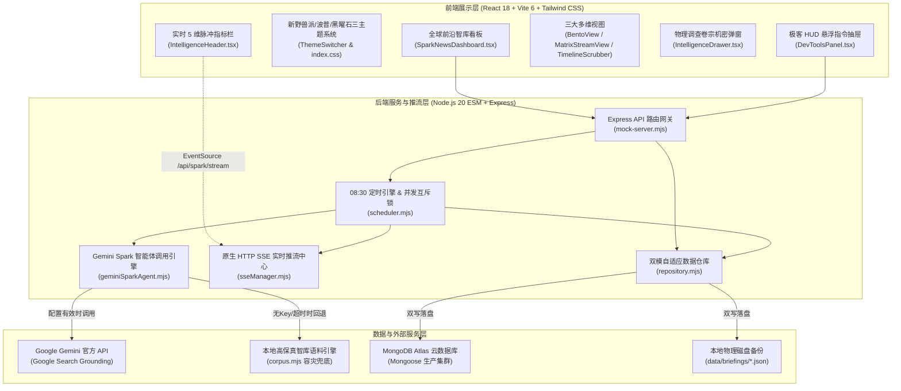
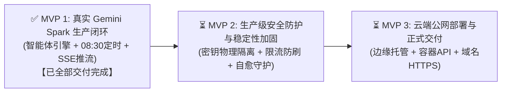

# Gemini Spark News 智库前端系统 · 完整项目研发交接档案 (Comprehensive Handover Document)

- **交接归档时间**: 2026-09-25 22:16 (UTC+8)
- **当前 Git 主线**: `master` (提交哈希 `5cbe4d3`，工作区干净，无未提交更改)
- **系统运行状态**: 
  - 前端开发服务: `http://localhost:5173` (Vite 6 HMR 实时热重载正常)
  - 后端 API 服务: `http://localhost:3001` (Express + SSE 实时推流 + MongoDB Atlas 双模持久化正常)
- **生产构建验证**: `npm run build` (TypeScript 类型检查 + Vite 打包 100% 成功，0 错误 0 警告，产物耗时 ~3.8s)
- **测试验证覆盖**: 
  - 4 套单元与接口集成测试全部通过 (19/19 passing)
  - 全链路 E2E 闭环自动化脚本 [`scripts/verify-spark-pipeline.mjs`](scripts/verify-spark-pipeline.mjs) 100% 通过
  - 全套 9 张 Retina 高清无头截图自动化回归测试套件 100% 通过

---

## 一、 项目核心定位与背景认知 (Critical Context)

### 1. 概念校准：什么是 Gemini Spark？
- **绝非 Apache Spark**：本项目中的“Spark”绝非传统的 Apache Spark 大数据处理集群或分布式 JVM 计算框架，亦非传统爬虫中间件；
- **真实定位**：**Google Gemini 定时自主智能体（Gemini Spark Autonomous Agent）**；
- **业务流程**：用户在 Google Gemini 中配置的每日定时任务，自主全网检索全球权威外媒（Reuters, Bloomberg, FT, Nature, WSJ 等），完成跨语种深度长文本提炼、宏观情绪极性量化打分（-1.0 至 +1.0）与命名实体识别（NER），输出结构化每日全球简报（JSON 格式）。前端看板负责将海量研报转化为高可读性、宏观决策级的交互式大屏。

### 2. 2026 年 9 月官方模型体系与选型规范
- **默认主力工作马（Default Workhorse）**: **`gemini-3.8-flash`**（Google 2026 年 9 月官方最新主力模型，专为 Agent 自动化工作流与低延迟检索提炼优化，1M Token 上下文）；
- **高阶推理模型（Deep Reasoning Candidate）**: **`gemini-3.1-pro`**（当前 Google 官方真实可用的旗舰深度推理模型，用于高难度多步复杂推理与宏观地缘博弈推演）；
- **严禁杜撰不存在的模型**：**官方目前并无 `gemini-3.8-pro`**，全系统在 API 入口层与智能体引擎层部署了严格白名单，任何尝试使用非官方模型的请求均被坚决拦截并返回 HTTP 400；
- **模型热切换机制**: 支持在后台 API (`POST /api/spark/models/select`) 与前端 DevTools 极客控制舱中动态热切换激活模型。

### 3. 极客 DevTools HUD 控制舱决策
- **决策结论**：本系统作为公共信息智库终端，面向受众展示权威情报，**无需开发繁重沉杂的独立后台管理端与用户体系**；
- **架构落地**：在前端右上角深度集成 **极客 HUD 悬浮指令抽屉（DevTools Panel）**，融合：
  1. 官方认证模型单选热切卡（Flash vs Pro）；
  2. 立即调度生成按钮（带阶段生成中锁定与防重复点击）；
  3. 实时 SSE 推流监视终端窗口（黑曜石风格，支持自动触底与一键清空）；
  4. 底层数据源探针、业务状态机模拟器与极端数据契约注入。

---

## 二、 系统架构与已交付模块全景 (Architecture Overview)



---

## 三、 已交付的两大核心里程碑 (Completed Phases)

### 🎨 Phase 0: 全站新野兽派与波普双主题视觉体系 (Teenage Engineering Neo-Brutalism)
1. **三大主题体系**：
   - **暗夜黑曜石主题 (`dark` / 默认)**：保持极客深邃黑曜石（`#030712`）、冷青微发光边框（`border-cyan-500/20`）与星云粒子底纹；通过 `[data-theme="dark"]` 绝对隔离，零样式污染；
   - **P2 经典档案羊皮纸淡色主题 (`light`)**：温暖沉稳的暖黄羊皮纸色（`#f4ebd9`），搭配 24px 工程微网格底纹，`2px/2.5px solid #000000` 黑色几何外框，零羽化实体硬阴影 `4px 4px 0 #000000`，悬停上浮与点击下沉机械触感；
   - **高能波普多巴胺主题 (`dopamine`)**：蜜桃粉底色（`#fff0f5`）、电光热粉实体硬阴影 `4px 4px 0 #ff007f`，悬停 `-0.5deg` 俏皮微倾斜与荧光碰撞。
2. **物理卷宗调查机密弹窗 (`IntelligenceDrawer.tsx`)**：
   - 粗黑外框 + `10px 10px 0 #000` 实体大投影，黄色便利贴核心摘要衬底（`#fefce8`），条形码与印章贴纸风格。
3. **GPU 像素接缝与漏边根治 (GPU Layer Seam Fix)**：
   - 卡片媒体区采用 `isolation: isolate; contain: paint; transform: translateZ(0)`，渐变蒙层向下延伸 2px，彻底杜绝 Windows 125%/150% 等高缩放比下图片边缘漏底。
4. **自动化截图回归套件**：
   - 位于 [`scripts/verify-themes.mjs`](scripts/verify-themes.mjs)，生成全套 9 张 2x Retina 高清截图于 [`screenshots/`](screenshots/)。

---

### ⚡ Phase 1 (MVP 1): 真实 Gemini Spark 智能体数据生产闭环与实时推流系统 (100% 完成)
1. **Task 1: Gemini Spark 核心引擎与模型管理器 ([`server/services/geminiSparkAgent.mjs`](server/services/geminiSparkAgent.mjs))**
   - 官方模型池白名单管理：默认工作马 `gemini-3.8-flash` 与深度推演 `gemini-3.1-pro`；
   - `buildSparkPrompt()`: 严格约束 Prompt 契约，输出合法 JSON；
   - Google Search Grounding 联网检索感知；
   - 双模自适应容灾：当未配置 API Key 或外部网络超时，毫秒级无缝回退至高保真语料生成引擎，**全系统 100% 零 500 崩溃**；
   - 契约校准器 `ensureBriefingContract()`: 保证 8 至 12 篇总量、1 篇 Critical Hero、1 至 2 篇 Climate、NLP 情感极性与非空实体提取。
2. **Task 2: 原生 SSE 实时推流中心 ([`server/services/sseManager.mjs`](server/services/sseManager.mjs))**
   - 基于原生 HTTP `text/event-stream` 实现多客户端实时推流与事件广播；
   - 连接时下发欢迎握手包 `CONNECTED` 并分配自增 Client ID；
   - 15 秒 `:heartbeat\n\n` 保活心跳机制，定时器使用 `.unref()` 避免阻塞 Node 退出；
   - 客户端异常断开自动移除，杜绝内存泄漏与悬挂 Socket。
3. **Task 3: 定时调度引擎与并发防重互斥锁 ([`server/services/scheduler.mjs`](server/services/scheduler.mjs))**
   - 每日 `08:30:00` 自动时钟巡检与生产任务唤醒；
   - 并发互斥锁：生成期间重入请求返回 `HTTP 409 Conflict` 与当前执行阶段进度；
   - 120 秒看门狗（Watchdog）防死锁超时保护，强制解锁并广播异常；
   - `runIdCounter` 单调递增标识符，彻底消除旧任务延迟返回造成的异步竞态污染；
   - `saveBriefing()`: MongoDB Atlas 云数据库与本地物理文件双写持久化。
4. **Task 4: 服务端 API 路由挂载与环境隔离 ([`server/mock-server.mjs`](server/mock-server.mjs))**
   - 挂载 `GET /api/spark/models`: 获取模型池与当前激活模型；
   - 挂载 `POST /api/spark/models/select`: 热切换模型（400 拦截非法模型）；
   - 挂载 `POST /api/spark/trigger-generate`: 手动即时触发批次生成（带日期正则校验）；
   - 挂载 `GET /api/spark/stream`: 原生 SSE 推流端点，注入 `X-Accel-Buffering: no` 防止反向代理缓冲；
   - 扩充 `GET /api/health` 探针数据，支持导出 `app` 并提供 `NODE_ENV !== 'test'` 守护。
5. **Task 5: 前端 API 层与 DevTools 智能体控制舱 ([`src/services/api.ts`](src/services/api.ts), [`src/components/DevToolsPanel.tsx`](src/components/DevToolsPanel.tsx))**
   - 封装严格类型化的请求方法：`fetchSparkModels`、`selectSparkModel`、`triggerSparkGenerate`；
   - 在 DevTools HUD 抽屉中打造 **Gemini Spark 智能体控制舱**：
     - 双模型可视化选择卡片，展示工作马/深度推演标签与热切状态；
     - 立即调度生产流按钮，支持生成中状态锁定与防重入防抖；
     - 实时推流监视终端窗口，格式化高亮推流日志并支持一键清空。
6. **Task 6: 前端看板 SSE 实时驱动与动态阶段可视化 ([`src/components/SparkNewsDashboard.tsx`](src/components/SparkNewsDashboard.tsx), [`src/components/IntelligenceHeader.tsx`](src/components/IntelligenceHeader.tsx))**
   - 全局建立 `EventSource('/api/spark/stream')` 监听；
   - 采用 `useRef` 持久化引用，彻底消除筛选、搜索或翻页引发的 SSE 频繁断连与重连抖动；
   - `IntelligenceHeader.tsx` 指标卡 1 动态呈现 5 阶段进度脉冲动画与精准进度条（如 `GENERATING 40%`）；
   - 指标卡 3 动态展示当前执行阶段说明（如 `阶段 SEARCHING: 正在联网检索...`），通过 `min-h-[28px]` 锁定高度彻底消除状态切换时的布局跳动（CLS）；
   - 收到 `COMPLETED` 广播后，平滑静默重新拉取最新数据，零白屏无感呈现新研报。
7. **Task 7: 端到端闭环验证与全站构建测试 ([`scripts/verify-spark-pipeline.mjs`](scripts/verify-spark-pipeline.mjs))**
   - 编写全自动 E2E 验证脚本，验证握手、模型池、非法模型拦截、模型热切、并发 409 拦截、5 阶段推流完整生命周期以及智库契约审计；
   - 100% 自动化测试通过；
   - 全站编译 `npm run build`（`tsc -b && vite build`）零错误零警告。

---

## 四、 后续路线图演进建议 (Next Steps)

以**“全站公网安全稳定上线正常运行”**为终极目标，建议后续按序推进 MVP 2 与 MVP 3：



### 🛡️ MVP 2：生产级安全防护与稳定性加固（上线前必须完成）
1. **密钥与敏感配置物理隔离**：
   - 严格规范 `.env.production`，确保 `GEMINI_API_KEY` 与 `MONGO_URI` 仅留存服务端，绝不暴露至前端客户端代码；
   - 为管理接口（手动批次触发、数据导入）增加基于 Header 的 `x-admin-key` 鉴权校验。
2. **生产环境 API 防护与限流防刷**：
   - 引入 `helmet` 保护 HTTP 响应头安全；
   - 引入 `express-rate-limit` 防止恶意高频攻击后端接口；
   - 严格限定生产环境 CORS 跨域域名白名单。
3. **进程守护与容灾自愈**：
   - 配置 PM2（`ecosystem.config.cjs`）或轻量 `Dockerfile`，确保后端服务崩溃秒级自动拉起；
   - 强化 MongoDB Atlas 偶发网络断线平滑重连与自动回退。
4. **前端构建优化与缓存控制**：
   - 验证静态文件 Gzip / Brotli 压缩配置与长期缓存策略（Cache-Control）。

### 🌐 MVP 3：云端公网部署与正式上线交付
1. **基础设施与部署选型**：
   - 前端：采用 Vercel / Cloudflare Pages 静态边缘托管（或 Nginx 反向代理）；
   - 后端 API：部署于云服务器或 Railway / Render 平台 Node.js 容器环境。
2. **生产环境网络连通与 MongoDB Atlas 白名单**：
   - 将云服务器/部署节点的公网 IP 纳入 MongoDB Atlas Network Access 白名单。
3. **自定义域名绑定与全站 HTTPS/SSL 自动化证书**。
4. **全流程线上实测与交付验收**：
   - 线上多端多设备实测；
   - 线上验证每日 08:30 自动生产与实时大屏更新。

---

## 五、 本地开发与运维指令速查手册

### 1. 常用指令
```bash
# 启动本地开发服务 (同时并发拉起后端 API 3001 与前端 Vite 5173)
npm run dev

# 执行全站生产构建编译 (TypeScript 严格类型检查 + Vite 优化打包)
npm run build

# 执行 Gemini Spark 全链路自动化 E2E 闭环验证
node scripts/verify-spark-pipeline.mjs

# 运行后端核心单元与集成测试套件
node tests/geminiSparkAgent.test.mjs    # 智能体引擎与模型切换测试
node tests/sseManager.test.mjs          # 原生 SSE 推流管理器测试
node tests/scheduler.test.mjs           # 08:30 调度引擎与并发互斥锁测试
node tests/apiEndpoints.test.mjs        # 服务端 API 路由集成测试

# 运行全套主题 Retina 高清截图自动化回归测试
node scripts/verify-themes.mjs

# 向 MongoDB Atlas 注入测试种子数据
npm run db:seed
```

### 2. 环境变量配置参考 (`.env`)
```bash
# 服务监听端口
PORT=3001

# MongoDB Atlas 云数据库连接串 (配置有效 URI 自动启用云端模式，连接受阻自动回退本地模式)
MONGO_URI=mongodb+srv://<username>:<password>@cluster0.ryzx3s0.mongodb.net/gemini_news?retryWrites=true&w=majority

# Google Gemini 智能体 API 密钥 (留空或未配置时自动启用高保真语料引擎，零 500 报错)
GEMINI_API_KEY=your_gemini_api_key_here

# 默认激活模型 (严格限定为 gemini-3.8-flash 或 gemini-3.1-pro)
GEMINI_MODEL=gemini-3.8-flash

# 每日定时调度生产时间 (默认 08:30)
SCHEDULE_TIME=08:30
```

---

## 六、 完整项目核心文件目录索引

```
e:/antigravity项目/资讯前端/
├── HANDOVER.md                                # [本项目] 完整交接报告与架构档案
├── package.json                               # 项目依赖与执行脚本配置
├── data/
│   └── briefings/                             # Gemini Spark 每日生成的结构化研报持久化目录
│       ├── README.md                          # 数据契约规范（8~12篇，气候限1~2篇，1篇Critical）
│       └── 2026-09-25.json                    # 当前归档的 12 篇全字段测试研报
├── docs/
│   └── superpowers/
│       ├── specs/                             # 视觉与系统设计规范
│       │   ├── 2026-09-25-neo-brutalist-themes-design.md
│       │   └── 2026-09-25-gemini-spark-pipeline-design.md
│       └── plans/                             # 实施计划与执行清单
│           ├── 2026-09-25-neo-brutalist-themes.md
│           └── 2026-09-25-gemini-spark-pipeline.md
├── screenshots/                               # 全套 9 张 Retina 高清主题回归测试截图
├── scripts/
│   ├── verify-spark-pipeline.mjs              # [新增] Gemini Spark 生产流全链路 E2E 自动化验证脚本
│   └── verify-themes.mjs                      # Puppeteer E2E 主题截图自动化回归套件
├── server/
│   ├── mock-server.mjs                        # [升级] Express API 核心服务入口 (3001)
│   ├── repository.mjs                         # [升级] 数据仓库层 (MongoDB Atlas 云端与本地物理文件双写)
│   ├── corpus.mjs                             # 本地智能降级高保真语料生成引擎 (100% 零 500 容灾)
│   ├── models/
│   │   ├── BatchStatus.mjs                    # Mongoose 批次状态模型
│   │   └── NewsItem.mjs                       # Mongoose 新闻研报模型
│   └── services/                              # [核心服务层]
│       ├── geminiSparkAgent.mjs               # [新增] Gemini 智能体调用引擎与官方模型白名单管理器
│       ├── scheduler.mjs                      # [新增] 08:30 定时调度引擎、并发互斥锁与看门狗
│       └── sseManager.mjs                     # [新增] 原生 HTTP SSE 实时推流中心与心跳保活
├── src/
│   ├── context/
│   │   └── ThemeContext.tsx                   # 全站主题 Context (dark / light / dopamine)
│   ├── services/
│   │   └── api.ts                             # [升级] 前端 API 层与 Spark 类型化接口
│   ├── components/
│   │   ├── DevToolsPanel.tsx                  # [升级] 极客 HUD 悬浮抽屉 (集成 Gemini Spark 智能体控制舱)
│   │   ├── IntelligenceHeader.tsx             # [升级] 顶部导视栏 (5 维指标卡、实时阶段动态进度条、CLS 消除)
│   │   ├── SparkNewsDashboard.tsx             # [升级] 全球智库主看板 (挂载 SSE 监听、无感静默热刷新)
│   │   ├── ThemeSwitcher.tsx                  # 顶部导航栏主题切换胶囊 (新野兽派/波普微交互)
│   │   ├── GlobalCategoryBar.tsx              # 领域分类贴纸 Tab、打字机检索框与视图切换
│   │   ├── GlobalNewsCard.tsx                 # 实体情报卡片 (防漏光、印章贴纸、机械虚线)
│   │   ├── IntelligenceDrawer.tsx             # 全球智库机密调查卷宗弹窗 (黄色便签纸物理排版)
│   │   ├── Pagination.tsx                     # 实体分页控制器
│   │   ├── ImportBriefingModal.tsx            # 手动导入智库简报弹窗
│   │   ├── RunningStateView.tsx               # 动态雷达扫描生成态视图
│   │   └── views/
│   │       ├── BentoView.tsx                  # Bento 智库看板视图 (Hero 头条置顶)
│   │       ├── MatrixStreamView.tsx           # 四象限矩阵流视图
│   │       └── TimelineScrubber.tsx           # 24H 时空轨迹时间轴视图
│   └── index.css                              # 全站新野兽派与波普双主题核心样式库
└── tests/                                     # [测试矩阵]
    ├── geminiSparkAgent.test.mjs              # 智能体引擎单元测试
    ├── sseManager.test.mjs                    # SSE 推流中心单元测试
    ├── scheduler.test.mjs                     # 调度器与并发互斥锁单元测试
    └── apiEndpoints.test.mjs                  # 服务端 API 端点集成测试
```
