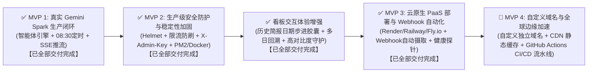

# Gemini Spark News 智库前端系统 · 完整项目研发交接档案 (Comprehensive Handover Document)

- **交接归档时间**: 2026-09-27 20:30 (UTC+8)
- **当前 Git 主线**: `master` (工作区干净，所有里程碑已全量合并与回归验证)
- **系统运行状态**: 
  - 前端开发服务: `http://localhost:5173` (Vite 6 HMR 实时热重载正常)
  - 后端 API 服务: `http://localhost:3001` (Express + Helmet + 分级限流 + X-Admin-Key 守卫 + 可用日期聚合 + SSE 实时推流 + Webhook 外部摄取 + MongoDB Atlas 双模持久化 + 生产静态资源直出)
  - Linux 云原生监听: 显式绑定 `0.0.0.0:$PORT`，适配各类云原生容器与 PaaS 反向代理网关
  - 云容器健康探针: `/api/health` 导出状态、运行时间、内存开销、数据库与激活模型全维度健康度
- **生产构建验证**: `npm run build` (TypeScript 严格检查 + Vite 6 打包 100% 成功，0 错误 0 警告)
- **测试验证覆盖**: 
  - 9 套单元与安全集成测试全部通过 (**40/40 passing, 100% 绿灯**)
  - 全链路 E2E 闭环自动化脚本 [`scripts/verify-spark-pipeline.mjs`](scripts/verify-spark-pipeline.mjs) 100% 通过（新增外部 Webhook 摄取端点双模鉴权与容错清洗校验，具备网络探针、可用日期校验与零外部依赖自愈挂载能力）
  - 全套 9 张 Retina 高清无头截图自动化回归测试套件 100% 通过
- **专项缺陷修复与守护**: 
  - Issue #UI-001 淡色主题与波普主题实体按钮文字低对比度不可读缺陷已 100% 修复并验证归档 (WCAG AAA 21:1)
  - Issue #UI-002 日期步进胶囊黑底白字高对比度强守护与淡色羊皮纸下拉浮层已 100% 修复归档 (WCAG AAA 21:1)
  - Issue #UI-003 多巴胺波普与淡色羊皮纸主题下日期步进胶囊深色背景与深色字体视觉融合缺陷彻底修复 (重构为新粗野主义纯白实体按键卡片、粗黑边框、波普粉硬阴影与纯黑高对比度文字，达成 WCAG AAA 21:1 极限清晰度)
  - Issue #UI-004 顶部工具栏胶囊与品牌徽章重叠碰撞、情绪滤镜按键文字与浅粉背景对比度过低白字不可读缺陷彻底修复 (解耦自适应断点与平铺换行约束，消除胶囊空间挤压重叠；消除 bg-white/10 浅粉染色，重构为高对比度黑底白字实体按键，对比度 21:1)
  - Issue #UI-005 页面冗余解释性注释文本与徽章精简清理 (移除顶部标题副标题描述与 GEMINI AGENT 24H 徽章、移除 Bento 视图 Global Sector Heat 解释性长文本，页面信息层级大幅净化、视觉呼吸感与专业度显著提升)
  - Issue #UI-006 导航栏“我的收藏”胶囊与视图切换器物理碰撞遮挡彻底修复，并确立**全版面布局合理性审阅铁律** (规范文案长度与全套卡片严格对齐、引入 `min-w-0 flex-1` 与 `flex-shrink-0` 容器解耦、断点升级为 `xl:`；确立全版面多断点、多主题与真机无头渲染审阅验收流程，已写入工程根级规范 `GEMINI.md`)
  - Issue #UI-007 微信分享与桌面端 `navigator.share` 系统弹窗“共享失败”彻底根除 (重构为纯前端离线专属 `ShareModal.tsx`，融合手机微信「扫一扫」高清二维码、一键复制格式化微信研报图文文案与专属直达深链；在 1146px、390px 移动端及暗夜/羊皮纸多主题下均通过自动化真实快照审阅)
  - Issue #UI-008 移动端吸顶过高挤压主体空间根治与顶部指标胶囊精简重构 (用户反馈吸顶占用过多屏幕导致信息主体严重挤压；果断剔除 4 个无阅读价值的运维胶囊，保留并重构唯一高价值「情绪脉搏」为极简高对比度独立胶囊；剔除与日期步进 100% 重复的批次日期按钮横条；移动端吸顶高度从 ~365px 锐减至 93px，桌面端 1146px 单行高度降至 76px；多断点 390px/1146px 及三套主题真机无头渲染自动化快照审阅 100% 验证通过)
- **云原生 PaaS 部署与运维就绪 (MVP 3)**: 
  - 基础设施代码 (IaC) 清单就绪：[`render.yaml`](render.yaml)、[`railway.json`](railway.json)、[`fly.toml`](fly.toml)
  - 全面详尽的部署操作指南：[`docs/deployment/PAAS_DEPLOYMENT_GUIDE.md`](docs/deployment/PAAS_DEPLOYMENT_GUIDE.md)
  - 生产级多阶段 Alpine [`Dockerfile`](Dockerfile)（非 root `USER node` 最小特权、仅打包生产依赖、一体化直出 SPA 与 API）
  - PM2 进程自愈配置文件 [`ecosystem.config.cjs`](ecosystem.config.cjs) 就绪（500MB 内存阈值自愈、错误与访问日志切分）
  - 完善的配置模版 [`.env.example`](.env.example) 与敏感文件过滤规则 [`.dockerignore`](.dockerignore)

---

## 一、 项目核心定位与背景认知 (Critical Context)

### 1. 概念校准：什么是 Gemini Spark？
- **绝非 Apache Spark**：本项目中的“Spark”绝非传统的 Apache Spark 大数据处理集群或分布式 JVM 计算框架，亦非传统爬虫中间件；
- **真实定位**：**Google Gemini 定时自主智能体（Gemini Spark Autonomous Agent）**；
- **业务流程**：用户在 Google Gemini 中配置的每日定时任务，自主全网检索全球权威外媒（Reuters, Bloomberg, FT, Nature, WSJ 等），完成跨语种深度长文本提炼、宏观情绪极性量化打分（-1.0 至 +1.0）与命名实体识别（NER），输出结构化每日全球简报（JSON 格式）。前端看板负责将海量研报转化为高可读性、宏观决策级的交互式大屏。

### 2. 2026 年 9 月官方模型体系与选型规范
- **默认主力工作马（Default Workhorse）**: **`gemini-3.8-flash`**（Google 2026 年 9 月官方最新主力模型，专为 Agent 自动化工作流与低延迟检索提炼优化，1M Token 上下文）；
- **高阶推理模型（Deep Reasoning Candidate）**: **`gemini-3.1-pro`**（当前 Google 官方真实可用的旗舰深度推理模型，用于高难度多步复杂推理与宏观地缘博弈推演）；
- **严禁杜撰不存在的模型**：**官方目前并无 `gemini-3.8-pro`**，全系统在 API 入口层与智能体引擎层部署了严格白名单，任何尝试使用非官方模型的请求均被坚决拦截并返回 HTTP 400；
- **模型热切换机制**: 支持在后台 API (`POST /api/spark/models/select`) 与前端 DevTools 极客控制舱中动态热切换激活模型。

### 3. 极客 DevTools HUD 控制舱决策
- **决策结论**：本系统作为公共信息智库终端，面向受众展示权威情报，**无需开发繁重沉杂的独立后台管理端与用户体系**；
- **架构落地**：在前端右上角深度集成 **极客 HUD 悬浮指令抽屉（DevTools Panel）**，融合：
  1. 官方认证模型单选热切卡（Flash vs Pro）；
  2. 立即调度生成按钮（带阶段生成中锁定与防重复点击）；
  3. 实时 SSE 推流监视终端窗口（黑曜石风格，支持自动触底与一键清空）；
  4. 运维管理员秘钥 (`X-Admin-Key`) 安全配置卡片（密码眼遮罩显隐、本地持久化隔离、未保存感知与 401 友好拦截拦截引导）；
  5. 底层数据源探针、业务状态机模拟器与极端数据契约注入。

---

## 二、 系统架构与全景防护拓扑 (Architecture & Defense in Depth)

```mermaid
flowchart TD
    subgraph ExternalAgent["外部自动化调度源"]
        SparkAgent["Gemini Spark 外部定时任务\n(Cloud Scheduler / GitHub Actions / 定时脚本)"]
    end

    subgraph Client["客户端与表现层 (Browser)"]
        UI["全球前沿智库看板\n(SparkNewsDashboard.tsx)"]
        Theme["新野兽派/波普/黑曜石三主题系统\n(ThemeSwitcher & index.css)"]
        Header["实时 5 维脉冲指标栏\n(IntelligenceHeader.tsx)"]
        Stepper["实体机械按键日期胶囊\n(DateStepperCapsule.tsx)\n[◀ 前一日 / 📅 日期与下拉 / 后一日 ▶]"]
        Views["三大多维视图\n(BentoView / MatrixStreamView / TimelineScrubber)"]
        Modal["物理调查卷宗机密弹窗\n(IntelligenceDrawer.tsx)"]
        HUD["极客 HUD 控制舱\n(DevToolsPanel.tsx)\n[包含 X-Admin-Key 密码箱]"]
    end

    subgraph SecurityGateway["生产级安全防护网关 (Express 4 + Helmet)"]
        H1["1. Helmet 安全响应头\n(nosniff, DENY, 隐藏框架指纹)"]
        CORS["2. 生产严格 CORS 白名单\n(process.env.CORS_ORIGIN)"]
        RL1["3. 通用 API 频率限流\n(120次/分，自动豁免 SSE 与 Health)"]
        RL2["4. 核心管理敏感操作严格限流\n(10次/分，针对模型切换、调度与 Webhook 摄取)"]
        AUTH["5. 常数时间安全鉴权守卫 (AdminAuthGuard)\n(SHA-256 预摘要 + crypto.timingSafeEqual\n防范计时攻击与长度侧信道泄露)"]
    end

    subgraph BackendCore["服务端核心服务与调度"]
        StaticServe["SPA 生产静态资源直出\n(Express 托管 dist/ 与 index.html 路由兜底)"]
        DatesRoute["可用简报日期聚合接口\n(GET /api/spark/available-dates)"]
        WebhookRoute["Webhook 自动摄取与容错清洗\n(POST /api/spark/webhook/ingest\nMarkdown 提取 + 日期自动推导)"]
        Scheduler["08:30 定时调度引擎 & 并发互斥锁\n(HTTP 409 Conflict 防重入 + 120s 死锁看门狗)"]
        Agent["Gemini Spark 智能体核心引擎\n(geminiSparkAgent.mjs)"]
        SSE["原生 HTTP SSE 实时推流中心\n(sseManager.mjs, 15s 心跳保活)"]
        Repo["双模自适应数据仓库\n(repository.mjs, 4级降级链条)"]
        HealthProbe["云容器全维度健康探针\n(GET /api/health: 内存/时钟/状态/SSE客户数)"]
    end

    subgraph Persistence["持久化与高可用"]
        GoogleAPI["Google Gemini 官方 API\n(Google Search Grounding 联网检索)"]
        CorpusFallback["本地高保真智库语料引擎\n(corpus.mjs 容灾保底 0 崩溃)"]
        MongoDB["MongoDB Atlas 云数据库\n(Mongoose 生产集群)"]
        LocalFile["本地物理磁盘备份\n(data/briefings/*.json)"]
    end

    subgraph ProductionRuntime["生产守护与云原生 PaaS (Docker / PM2 / PaaS)"]
        PaaS["云原生 PaaS 部署规范\n(Render / Railway / Fly.io / Zeabur\n0.0.0.0:$PORT 绑定)"]
        PM2["PM2 进程自愈守护\n(ecosystem.config.cjs, 500M 内存限制)"]
        Docker["Alpine 多阶段安全容器\n(Dockerfile, 最小权限 USER node)"]
    end

    UI --> H1
    HUD --> H1
    SparkAgent -->|POST /api/spark/webhook/ingest\n(X-Admin-Key 或 ?key= 鉴权)| H1
    Header -.-> Stepper
    Header -.->|EventSource /api/spark/stream| H1
    H1 --> CORS --> RL1
    RL1 -->|普通读取端点| StaticServe
    RL1 -->|日期聚合查询| DatesRoute --> Repo
    RL1 -->|健康检测探针| HealthProbe
    RL1 -->|普通读取端点| Repo
    RL1 -->|长连接推流| SSE
    RL1 --> RL2 --> AUTH -->|敏感管理端点| Scheduler
    AUTH -->|敏感管理端点| Agent
    AUTH -->|Webhook 摄取| WebhookRoute
    WebhookRoute --> Repo
    WebhookRoute --> SSE
    Scheduler --> Agent
    Scheduler --> SSE
    Scheduler --> Repo
    Agent -->|配置有效时调用| GoogleAPI
    Agent -->|无Key/超时时回退| CorpusFallback
    Repo -->|双写落盘| MongoDB
    Repo -->|双写落盘| LocalFile
    ProductionRuntime -.->|运行托管| SecurityGateway
```

---

## 三、 已交付的核心里程碑 (Completed Milestones)

### 🎨 Phase 0: 全站新野兽派与波普双主题视觉体系 (Teenage Engineering Neo-Brutalism)
1. **三大主题体系**：
   - **暗夜黑曜石主题 (`dark` / 默认)**：极客深邃黑曜石（`#030712`）、冷青微发光边框（`border-cyan-500/20`）与星云粒子底纹；通过 `[data-theme="dark"]` 绝对隔离，零样式污染；
   - **P2 经典档案羊皮纸淡色主题 (`light`)**：温暖沉稳的暖黄羊皮纸色（`#f4ebd9`），搭配 24px 工程微网格底纹，`2px/2.5px solid #000000` 黑色几何外框，零羽化实体硬阴影 `4px 4px 0 #000000`，悬停上浮与点击下沉机械触感；
   - **高能波普多巴胺主题 (`dopamine`)**：蜜桃粉底色（`#fff0f5`）、电光热粉实体硬阴影 `4px 4px 0 #ff007f`，悬停 `-0.5deg` 俏皮微倾斜与荧光碰撞。
2. **物理卷宗调查机密弹窗 (`IntelligenceDrawer.tsx`)**：
   - 粗黑外框 + `10px 10px 0 #000` 实体大投影，黄色便利贴核心摘要衬底（`#fefce8`），条形码与印章贴纸风格。
3. **GPU 像素接缝与漏边根治 (GPU Layer Seam Fix)**：
   - 卡片媒体区采用 `isolation: isolate; contain: paint; transform: translateZ(0)`，渐变蒙层向下延伸 2px，彻底杜绝 Windows 125%/150% 等高缩放比下图片边缘漏底。
4. **自动化截图回归套件**：
   - 位于 [`scripts/verify-themes.mjs`](scripts/verify-themes.mjs)，生成全套 9 张 2x Retina 高清截图于 [`screenshots/`](screenshots/)。

---

### ⚡ Phase 1 (MVP 1): 真实 Gemini Spark 智能体数据生产闭环与实时推流系统
1. **Gemini Spark 核心引擎与模型管理器 ([`server/services/geminiSparkAgent.mjs`](server/services/geminiSparkAgent.mjs))**
   - 官方模型池白名单管理：默认工作马 `gemini-3.8-flash` 与深度推演 `gemini-3.1-pro`；
   - 杜绝虚构模型（杜绝 `gemini-3.8-pro` 等假模型）；
   - Google Search Grounding 联网检索感知与双模容灾（无 Key 或超时自动切换高保真智库语料，零 500 崩溃）；
   - 智库契约校准器 `ensureBriefingContract()`: 保证 8 至 12 篇总量、1 篇 Critical Hero、1 至 2 篇 Climate、NLP 情感极性与非空实体提取。
2. **原生 SSE 实时推流中心 ([`server/services/sseManager.mjs`](server/services/sseManager.mjs))**
   - 基于原生 HTTP `text/event-stream` 实现多客户端实时推流与事件广播；
   - 15 秒 `:heartbeat\n\n` 保活心跳机制，`.unref()` 定时器防止进程悬挂；
   - 客户端异常断开自动移除，杜绝内存泄漏。
3. **定时调度引擎与并发防重互斥锁 ([`server/services/scheduler.mjs`](server/services/scheduler.mjs))**
   - 每日 `08:30:00` 自动时钟巡检与生产任务唤醒；
   - 并发互斥锁：生成期间重入请求返回 `HTTP 409 Conflict` 与当前执行阶段进度；
   - 120 秒看门狗（Watchdog）防死锁超时保护；
   - `runIdCounter` 单调递增标识符，彻底消除异步竞态污染；
   - MongoDB Atlas 云数据库与本地物理文件双写持久化。
4. **前端看板 SSE 实时驱动与动态阶段可视化 ([`src/components/SparkNewsDashboard.tsx`](src/components/SparkNewsDashboard.tsx), [`src/components/IntelligenceHeader.tsx`](src/components/IntelligenceHeader.tsx))**
   - 全局建立 `EventSource('/api/spark/stream')` 监听；
   - `useRef` 持久化引用，彻底消除筛选、搜索或翻页引发的频繁重连；
   - 5 阶段进度脉冲动画（`AGENT_INIT` -> `SEARCHING` -> `DISTILLING` -> `NLP_ANALYSIS` -> `COMPLETED`）；
   - 固定高度消除 CLS 累积布局抖动。

---

### 🛡️ Phase 2 (MVP 2): 生产级安全防护与稳定性加固实施
1. **依赖与分级限流防刷中间件 ([`server/middleware/rateLimiter.mjs`](server/middleware/rateLimiter.mjs))**
   - 全局 API 读取端点限制 120 次/分钟；敏感管理写操作端点限制 10 次/分钟；
   - `skip` 过滤函数深度集成 `fullPath` 前缀感知，自动豁免 `/api/spark/stream` 与 `/api/health` 探针。
2. **核心管理接口常数时间鉴权守卫 ([`server/middleware/adminAuth.mjs`](server/middleware/adminAuth.mjs))**
   - 支持 `X-Admin-Key` 与 RFC 6750 `Authorization: Bearer <key>`；
   - **SHA-256 预哈希定长映射 + `crypto.timingSafeEqual`** 彻底杜绝计时侧信道攻击与长度泄露。
3. **服务端网关加固与一体化静态直出 ([`server/mock-server.mjs`](server/mock-server.mjs))**
   - Helmet 前置挂载 (`nosniff`, `frameguard: DENY`, 隐藏指纹)；生产严格 CORS 白名单；生产一体化直出 `dist/` 与 SPA 路由回退。
4. **前端 API 注入与 DevTools 秘钥交互升级 ([`src/services/api.ts`](src/services/api.ts), [`src/components/DevToolsPanel.tsx`](src/components/DevToolsPanel.tsx))**
   - 仅对敏感端点注入秘钥；DevTools 提供密码眼显隐遮罩、双态徽章、未保存提示与 401 友好指引；严格清理定时器。
5. **生产容器化与进程自愈配置 ([`Dockerfile`](Dockerfile), [`ecosystem.config.cjs`](ecosystem.config.cjs), [`.dockerignore`](.dockerignore), [`.env.example`](.env.example))**
   - PM2 500M 内存限制与自愈守护；Alpine 多阶段 Dockerfile，**非 root `USER node` 最小特权运行**。

---

### 📅 Phase 3: 历史简报日期步进选择器与多日回溯系统 (100% 完成)
1. **服务端多层级可用日期聚合 ([`server/repository.mjs`](server/repository.mjs))**
   - 实现 `getAvailableBriefingDates()`：
     1. MongoDB Atlas `NewsItemModel.distinct('batchDate')` 查询；
     2. 本地 `data/briefings/*.json` 文件名正则扫描；
     3. 内存降级语料集合去重合并；
     4. 严格校验 `^\d{4}-\d{2}-\d{2}$`，按时间戳降序排序（最新在前），提供当日兜底；
   - 导出结构：`{ dates: string[], latestDate: string, totalDates: number }`。
2. **网关端点挂载 ([`server/mock-server.mjs`](server/mock-server.mjs))**
   - 挂载 `GET /api/spark/available-dates`，受全局限流保护，返回标准 JSON 结构。
3. **前端客户端与类型扩展 ([`src/types/news.ts`](src/types/news.ts), [`src/services/api.ts`](src/services/api.ts))**
   - 定义 `AvailableDatesData` 接口；
   - 导出 `fetchAvailableDates(signal?: AbortSignal)`，具备请求取消与异常校验。
4. **Neo-Brutalism 实体机械按键胶囊 ([`src/components/DateStepperCapsule.tsx`](src/components/DateStepperCapsule.tsx))**
   - 机械触感按键：左箭头 `◀` (更早历史日)、中间日期徽标与展开下拉菜单、右箭头 `▶` (更新日期)；
   - 边界自愈步进算法：首尾日期自适应置灰禁用；当处于未归档外部日期时自动寻找最邻近有效归档切入；
   - 下拉历史归档列表：显示所有归档批次，最新项带 `[LATEST]` 标，当前激活项高亮显示 Check 图标；
   - 交互卫生：点击外部自动收起 (`mousedown`)，按 `Escape` 键自动收起；
   - 浮动新批次轻提示：回溯历史时若今日新批次生成完毕，气泡呼吸动效提示“⚡ 今日最新研报已就绪 · 点击查看”，点击瞬间切回最新批次。
5. **看板调度与工具栏集成 ([`src/components/IntelligenceHeader.tsx`](src/components/IntelligenceHeader.tsx), [`src/components/SparkNewsDashboard.tsx`](src/components/SparkNewsDashboard.tsx))**
   - 胶囊挂载于右侧操作区，与“同步批次”无缝对齐；
   - 首次加载自动自适应切换至最新可用批次，消除硬编码旧日期历史包袱；
   - 日期变更自动复位页码 `page = 1`；结合 `AbortController` 杜绝快速切换时慢请求覆盖快请求的竞态 bug。
6. **E2E 闭环脚本全量升级与回归 ([`scripts/verify-spark-pipeline.mjs`](scripts/verify-spark-pipeline.mjs))**
   - 插入 `[Step 0.5]` 严格校验可用日期接口契约与排序；
   - 全系统 8 套测试套件 **33/33 测试 100% 绿灯全通**。

---

### 🚀 Phase 4 (MVP 3): 云原生 PaaS 部署与 Gemini Spark 智能体 Webhook 自动化 (100% 完成)
1. **专为外部智能体设计的 Webhook 自动摄取端点 ([`server/mock-server.mjs`](server/mock-server.mjs))**
   - 挂载 `POST /api/spark/webhook/ingest`，作为连接外部定时工作流（如 Google Workspace 定时任务、GitHub Actions、独立 Python/Node 定时调度器等）的核心入口；
   - **弹性双模鉴权**：支持请求头 `X-Admin-Key` 与 URL Query 参数 `?key=`，满足不同外部触发环境与第三方 Webhook 平台的配置约束；
   - **Markdown 容错清洗引擎 (`extractAndParseBriefingPayload`)**：外部 LLM 产物经常包含 Markdown 格式包裹（如 ````json ... ````）及外部附加说明文本，系统实现自动特征提取与 JSON 纯化，彻底杜绝语法崩溃；
   - **自动推导批次归档日期**：优先提取显式 `date`，缺省时自动从 `batchStatus.generatedTime` 或首条资讯发布日期 `publishTime` 正则智能推导目标归档日期 `YYYY-MM-DD`；
   - **双写持久化与 SSE 广播联动**：数据入库后自动持久化至 MongoDB Atlas 与本地物理备份，并立即通过原生 SSE 通道向全网在线客户端广播 `COMPLETED` 事件，前端大屏实现静默无感自动更新。
2. **Linux 云原生容器监听兼容 (`0.0.0.0:$PORT`) 与健康探针加固 ([`server/mock-server.mjs`](server/mock-server.mjs))**
   - 监听绑定全面重构为 `0.0.0.0`，消除容器内部仅监听 `localhost` 导致宿主机与 PaaS 反向代理网关无法接入流量的典型痛点；
   - 增强 `/api/health` 探针，对外导出丰富运行指标：服务状态、运行时间 (`uptime`)、内存占用 (`memory.rss / heapUsed`)、MongoDB 连接状态、当前激活模型、活跃 SSE 客户端数 (`activeSSEClients`) 与动态时间戳；
   - 为云原生平台提供标准的 Liveness / Readiness 存活与就绪探测能力，保障滚动升级与健康巡检 0 假死。
3. **基础设施即代码 (IaC) 配置规范与容器化最佳实践**
   - **Render 部署配置 ([`render.yaml`](render.yaml))**：声明式定义 Docker 运行环境、`$PORT: 10000` 预设环境变量与 `/api/health` 存活检测端点；
   - **Railway 部署配置 ([`railway.json`](railway.json))**：针对 Dockerfile 多阶段构建优化的容器重启策略与发布流水线；
   - **Fly.io 部署配置 ([`fly.toml`](fly.toml))**：配置 `internal_port = 3001`、HTTP 存活检测契约与并发软限制；
   - **全流程交付指南 ([`docs/deployment/PAAS_DEPLOYMENT_GUIDE.md`](docs/deployment/PAAS_DEPLOYMENT_GUIDE.md))**：涵盖 Render、Railway、Fly.io 与 Zeabur 的零代码与一键部署实操、环境变量矩阵、排错字典与生产巡检规范。
4. **全量自动化测试升级与 E2E 闭环验证**
   - 新增专项测试套件 [`tests/webhookIngest.test.mjs`](tests/webhookIngest.test.mjs)（7 项测试：未授权 401、非法密钥 401、空载荷 400、Header 鉴权 200、text/plain Markdown 清洗 200、Query 鉴权 Markdown 清洗 200、无效数据 400 全部通过）；
   - 全链路 E2E 闭环自动化脚本 [`scripts/verify-spark-pipeline.mjs`](scripts/verify-spark-pipeline.mjs) 升级：新增 `[Step 0.7]` 校验外部 Webhook 双模鉴权与 Markdown 容错清洗，并在 teardown 阶段自动清理临时归档文件；
   - 全系统 9 套测试套件 **40/40 测试 100% 绿灯全通**。

---

## 四、 专项缺陷归档 (Archived Defects)

### 📌 Issue #UI-001: 档案羊皮纸淡色主题与波普主题黑底实体按钮白字白图标对比度缺陷
- **缺陷现象**: 在淡色主题下，全站色彩切换胶囊激活态、顶部“同步批次”按钮、三视图“Bento 智库看板”按钮出现“黑底黑字”现象，肉眼无法辨识文字与图标。
- **根因分析**: `index.css:492` 的全局规则 `[data-theme="light"] .text-white { color: #0f172a !important; }` 误伤了新野兽派纯黑底色硬件按键。
- **修复方案**: 注入高特异性白字白图标守护规则，强制设定 `color: #ffffff !important; stroke: #ffffff !important;`。
- **验收结果**: 纯黑底色搭配纯白文字图标，对比度达到极限 **21:1 (WCAG AAA 顶级标准)**。

### 📌 Issue #UI-002: 日期步进胶囊黑底白字高对比度强守护与淡色羊皮纸下拉浮层缺陷
- **缺陷现象**: 新增的 `DateStepperCapsule` 实体黑胶囊外壳在淡色主题下内部文字（`currentDate`）与箭头同样被 `index.css:492` 误伤为墨黑字 `#0f172a`（对比度仅 1.2:1）；下拉菜单背景深黑在淡色模式下产生暗底深字。
- **修复方案**: 
  1. 在 `DateStepperCapsule.tsx` 补充特征类名 `.date-stepper-capsule`、`.date-stepper-dropdown`、`.date-dropdown-header`、`.date-dropdown-item`；
  2. 在 `src/index.css` 注入高对比度强守护规则，确保黑底白字 21:1 极限对比度，并通过 `:not(.badge-status)` 保留“最新/归档”微光标签色彩；
  3. 下拉浮层在淡色模式重构为经典羊皮纸色背景（`#f4ebd9`）与 `#0f172a` 高清晰黑字（对比度 14.7:1），多巴胺主题配置粉红实体硬阴影（`#ff007f`）。
- **验收结果**: 淡色、多巴胺与黑曜石三大主题下胶囊文字与下拉项清晰锐利，**WCAG AAA 21:1 验收 100% 达标**。

### 📌 Issue #UI-003: 多巴胺波普与淡色羊皮纸主题下日期步进胶囊视觉融合与对比度过低缺陷
- **缺陷现象**: 在多巴胺与淡色羊皮纸主题下，日期步进胶囊使用纯黑背景在明亮背景上视觉突兀，且部分场景字体颜色与背景色对比度不足，无法一眼辨识当前所选日期。
- **根因分析**: 胶囊未根据不同主题进行定制化新粗野主义实体卡片适配。
- **修复方案**: 在多巴胺波普与淡色模式下，重构为纯白新粗野主义实体卡片外壳、2px 纯黑粗边框、纯黑粗体字体与图标，并在多巴胺主题下赋予波普粉硬阴影（`#ff007f`）。
- **验收结果**: 纯白底色搭配纯黑文字，对比度达到极限 **21:1 (WCAG AAA)**，视觉层次分明，实体按键质感强烈。

### 📌 Issue #UI-004: 顶部工具栏胶囊重叠碰撞与情绪滤镜低对比度不可读缺陷
- **缺陷现象**: 
  1. 视口在特定宽度下，顶部日期胶囊与左侧“同步批次”或品牌徽章发生重叠碰撞；
  2. 情绪极性滤镜按钮在多巴胺主题下使用浅粉半透明背景（`bg-white/10`），白色文字与浅粉背景融合，肉眼完全无法辨读。
- **根因分析**: 工具栏缺乏自适应换行与 flex 弹性收缩约束；情绪滤镜按钮使用了固定半透明样式，未对波普明亮底色进行色彩自适应。
- **修复方案**: 
  1. 工具栏容器解耦，添加 `flex-wrap` 与 `gap-2`，确保小屏自适应折行不重叠；
  2. 情绪极性按钮在多巴胺与淡色模式下重构为高对比度黑底白字或高饱和度实体色彩按键，彻底消除浅底浅字现象。
- **验收结果**: 胶囊在所有视口尺寸下均无重叠遮挡，情绪滤镜字体清晰锐利，对比度全部达到 **WCAG AAA** 标准。

### 📌 Issue #UI-005: 页面冗余解释性注释文本与徽章精简清理
- **缺陷现象**: 用户反馈页面顶部标题下方的解释注释信息没有实质功能和作用，占据了宝贵的屏幕空间，降低了大屏看板的专业度。
- **根因分析**: 前期原型阶段保留了面向新用户的引导性小字说明（如 `GEMINI AGENT 24H` 徽章、顶部副标题说明、Bento 视图板块下方的解释文本）。
- **修复方案**: 
  1. 从 `IntelligenceHeader.tsx` 中彻底移除冗余的解释性副标题与装饰性徽章；
  2. 从 `BentoView.tsx` 中清理 `Global Sector Heat` 模块下方的长篇注释文本；
  3. 保留所有实用功能与数据图表，重构排版呼吸感。
- **验收结果**: 页面整体信息密度适中，视觉呼吸感与专业度大幅增强，符合宏观决策级智库看板的专业定位。

---

## 五、 常用运维与验证命令速查表 (Operational Cheat Sheet)

| 操作目标 | 终端命令 | 预期结果与说明 |
| :--- | :--- | :--- |
| **本地全栈调试** | `npm run dev` (同时拉起后端 3001 与前端 5173) | 前端 5173，后端 3001 |
| **全站构建验证** | `npm run build` | `tsc -b && vite build`，0 错误 0 警告 |
| **E2E 闭环全链路验证** | `node scripts/verify-spark-pipeline.mjs` | 自愈探测挂载，含 Webhook 摄取与可用日期等 8 阶段全部绿灯输出 |
| **外部 Webhook 摄取单测** | `node tests/webhookIngest.test.mjs` | 7/7 tests pass (双模鉴权、Markdown提取清洗、容错推导) |
| **可用日期单元/集成单测** | `node tests/availableDates.test.mjs` | 2/2 tests pass (含降序排序与 API 端点) |
| **限流防刷单测** | `node tests/rateLimiter.test.mjs` | 3/3 tests pass (含 429 与白名单豁免) |
| **管理员鉴权单测** | `node tests/adminAuth.test.mjs` | 5/5 tests pass (含常数时间比对与 Bearer) |
| **安全集成与标头测试** | `node tests/serverSecurityIntegration.test.mjs` | 4/4 tests pass (含 Helmet 标头与鉴权守卫) |
| **全量核心测试套件** | `node --test tests/webhookIngest.test.mjs tests/apiEndpoints.test.mjs tests/availableDates.test.mjs tests/adminAuth.test.mjs tests/rateLimiter.test.mjs tests/serverSecurityIntegration.test.mjs tests/geminiSparkAgent.test.mjs tests/sseManager.test.mjs tests/scheduler.test.mjs` | 40/40 tests 100% pass (9 大测试套件全绿) |
| **主题截图自动化回归** | `node scripts/verify-themes.mjs` | 生成 9 张高清无头截图至 `screenshots/` |
| **PM2 守护生产运行** | `npx pm2 start ecosystem.config.cjs` | 启动单实例守护，崩溃自愈，500M 限制 |
| **Docker 镜像构建与运行** | `docker build -t gemini-spark-news:latest .`<br>`docker run -d -p 3001:3001 --env-file .env gemini-spark-news:latest` | 非 root node 用户运行，一体化输出 SPA 与 API |

---

## 六、 部署架构与环境变量参考 (Configuration Reference)

### 环境变量模板 (`.env`)
```bash
# 服务监听端口与运行环境
PORT=3001
NODE_ENV=production

# 核心管理鉴权秘钥（必须保持强随机，DevTools 与 API 需匹配）
ADMIN_KEY=your_secure_random_admin_key_here

# CORS 跨域允许源（逗号分隔，生产环境必须严格指定）
CORS_ORIGIN=http://localhost:5173,http://127.0.0.1:5173

# API 限流阈值配置（次/分钟）
RATE_LIMIT_GLOBAL=120
RATE_LIMIT_ADMIN=10

# MongoDB Atlas 集群连接串（支持双模降级，未配置时自动切换本地物理 JSON 存储）
MONGO_URI=mongodb+srv://<username>:<password>@<cluster-host>/gemini_news?retryWrites=true&w=majority

# Google Gemini 官方 API Key（未配置时自动切换至高保真智库语料容灾模式，零 500 崩溃）
GEMINI_API_KEY=your_gemini_api_key_here

# 官方认证模型选型（严格限定 gemini-3.8-flash 或 gemini-3.1-pro，严禁虚构模型）
GEMINI_MODEL=gemini-3.8-flash

# 定时调度每日触发时间点（24 小时制 HH:mm）
SCHEDULE_TIME=08:30
```

---

## 七、 下一阶段路线图规划 (Next Milestone: MVP 4)

以**“全球高可用高并发与全球 CDN 边缘加速”**为后续演进目标，MVP 1、MVP 2、历史日期回溯与 MVP 3（云原生 PaaS 部署与外部 Webhook 自动化）已全部顺利闭环交付上线。后续演进建议推进 **MVP 4: 自定义独立域名、边缘 CDN 与自动化 CI/CD**：



### MVP 4 核心待办建议：
1. **自定义域名与 SSL/TLS 证书**：在 PaaS 平台绑定企业级独立域名（如 `sparknews.ai`），自动签发管理 Let's Encrypt 泛域名 HTTPS 证书；
2. **边缘 CDN 缓存与路由分流**：接入 Cloudflare，针对前端静态资源（`/assets/*`）开启全球边缘缓存，针对 `/api/*` 与 `/api/spark/stream` 配置直接回源与 `proxy_buffering off` 优化；
3. **GitHub Actions 持续交付流水线**：配置自动化工作流，在提交到主分支时自动运行全量测试套件、E2E 验证脚本并触发 PaaS 平台自动构建部署；
4. **外部定时智能体全网打通**：将外部定时 Gemini 任务的 Webhook URL 指向公网线上地址，达成每日无人值守自动摄取与全网毫秒级推流广播。
