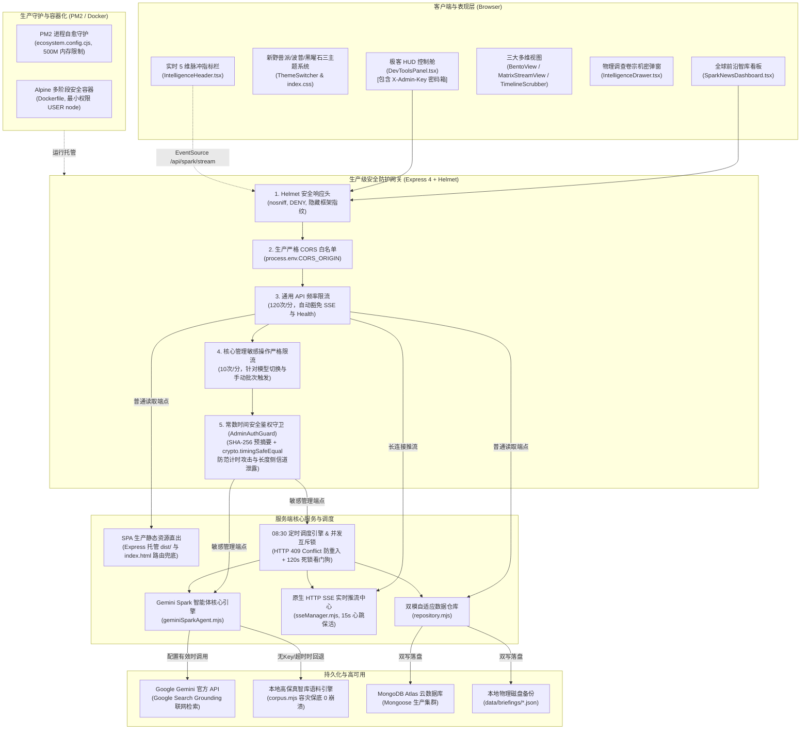
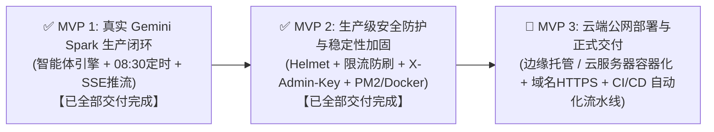

# Gemini Spark News 智库前端系统 · 完整项目研发交接档案 (Comprehensive Handover Document)

- **交接归档时间**: 2026-09-26 11:55 (UTC+8)
- **当前 Git 主线**: `master` (工作区干净，所有里程碑已全量合并与回归验证)
- **系统运行状态**: 
  - 前端开发服务: `http://localhost:5173` (Vite 6 HMR 实时热重载正常)
  - 后端 API 服务: `http://localhost:3001` (Express + Helmet + 分级限流 + X-Admin-Key 守卫 + SSE 实时推流 + MongoDB Atlas 双模持久化 + 生产静态资源直出)
- **生产构建验证**: `npm run build` (TypeScript 严格检查 + Vite 6 打包 100% 成功，0 错误 0 警告)
- **测试验证覆盖**: 
  - 7 套单元与安全集成测试全部通过 (**28/28 passing, 100% 绿灯**)
  - 全链路 E2E 闭环自动化脚本 [`scripts/verify-spark-pipeline.mjs`](scripts/verify-spark-pipeline.mjs) 100% 通过（具备网络探针与零外部依赖自愈挂载能力）
  - 全套 9 张 Retina 高清无头截图自动化回归测试套件 100% 通过
- **专项缺陷修复**: 
  - Issue #UI-001 淡色主题与波普主题实体按钮文字低对比度不可读缺陷已 100% 修复并验证归档 (WCAG AAA 21:1)
- **生产部署就绪**: 
  - PM2 进程自愈配置文件 [`ecosystem.config.cjs`](ecosystem.config.cjs) 就绪（500MB 内存阈值自愈、错误与访问日志切分）
  - 生产级多阶段 Alpine [`Dockerfile`](Dockerfile) 就绪（非 root `USER node` 最小特权、仅打包生产依赖）
  - 完善的配置模版 [`.env.example`](.env.example) 与敏感文件过滤规则 [`.dockerignore`](.dockerignore)

---

## 一、 项目核心定位与背景认知 (Critical Context)

### 1. 概念校准：什么是 Gemini Spark？
- **绝非 Apache Spark**：本项目中的“Spark”绝非传统的 Apache Spark 大数据处理集群或分布式 JVM 计算框架，亦非传统爬虫中间件；
- **真实定位**：**Google Gemini 定时自主智能体（Gemini Spark Autonomous Agent）**；
- **业务流程**：用户在 Google Gemini 中配置的每日定时任务，自主全网检索全球权威外媒（Reuters, Bloomberg, FT, Nature, WSJ 等），完成跨语种深度长文本提炼、宏观情绪极性量化打分（-1.0 至 +1.0）与命名实体识别（NER），输出结构化每日全球简报（JSON 格式）。前端看板负责将海量研报转化为高可读性、宏观决策级的交互式大屏。

### 2. 2026 年 9 月官方模型体系与选型规范
- **默认主力工作马（Default Workhorse）**: **`gemini-3.8-flash`**（Google 2026 年 9 月官方最新主力模型，专为 Agent 自动化工作流与低延迟检索提炼优化，1M Token 上下文）；
- **高阶推理模型（Deep Reasoning Candidate）**: **`gemini-3.1-pro`**（当前 Google 官方真实可用的旗舰深度推理模型，用于高难度多步复杂推理与宏观地缘博弈推演）；
- **严禁杜撰不存在的模型**：**官方目前并无 `gemini-3.8-pro`**，全系统在 API 入口层与智能体引擎层部署了严格白名单，任何尝试使用非官方模型的请求均被坚决拦截并返回 HTTP 400；
- **模型热切换机制**: 支持在后台 API (`POST /api/spark/models/select`) 与前端 DevTools 极客控制舱中动态热切换激活模型。

### 3. 极客 DevTools HUD 控制舱决策
- **决策结论**：本系统作为公共信息智库终端，面向受众展示权威情报，**无需开发繁重沉杂的独立后台管理端与用户体系**；
- **架构落地**：在前端右上角深度集成 **极客 HUD 悬浮指令抽屉（DevTools Panel）**，融合：
  1. 官方认证模型单选热切卡（Flash vs Pro）；
  2. 立即调度生成按钮（带阶段生成中锁定与防重复点击）；
  3. 实时 SSE 推流监视终端窗口（黑曜石风格，支持自动触底与一键清空）；
  4. 运维管理员秘钥 (`X-Admin-Key`) 安全配置卡片（密码眼遮罩显隐、本地持久化隔离、未保存感知与 401 友好拦截拦截引导）；
  5. 底层数据源探针、业务状态机模拟器与极端数据契约注入。

---

## 二、 系统架构与全景防护拓扑 (Architecture & Defense in Depth)



---

## 三、 已交付的核心里程碑 (Completed Milestones)

### 🎨 Phase 0: 全站新野兽派与波普双主题视觉体系 (Teenage Engineering Neo-Brutalism)
1. **三大主题体系**：
   - **暗夜黑曜石主题 (`dark` / 默认)**：极客深邃黑曜石（`#030712`）、冷青微发光边框（`border-cyan-500/20`）与星云粒子底纹；通过 `[data-theme="dark"]` 绝对隔离，零样式污染；
   - **P2 经典档案羊皮纸淡色主题 (`light`)**：温暖沉稳的暖黄羊皮纸色（`#f4ebd9`），搭配 24px 工程微网格底纹，`2px/2.5px solid #000000` 黑色几何外框，零羽化实体硬阴影 `4px 4px 0 #000000`，悬停上浮与点击下沉机械触感；
   - **高能波普多巴胺主题 (`dopamine`)**：蜜桃粉底色（`#fff0f5`）、电光热粉实体硬阴影 `4px 4px 0 #ff007f`，悬停 `-0.5deg` 俏皮微倾斜与荧光碰撞。
2. **物理卷宗调查机密弹窗 (`IntelligenceDrawer.tsx`)**：
   - 粗黑外框 + `10px 10px 0 #000` 实体大投影，黄色便利贴核心摘要衬底（`#fefce8`），条形码与印章贴纸风格。
3. **GPU 像素接缝与漏边根治 (GPU Layer Seam Fix)**：
   - 卡片媒体区采用 `isolation: isolate; contain: paint; transform: translateZ(0)`，渐变蒙层向下延伸 2px，彻底杜绝 Windows 125%/150% 等高缩放比下图片边缘漏底。
4. **自动化截图回归套件**：
   - 位于 [`scripts/verify-themes.mjs`](scripts/verify-themes.mjs)，生成全套 9 张 2x Retina 高清截图于 [`screenshots/`](screenshots/)。

---

### ⚡ Phase 1 (MVP 1): 真实 Gemini Spark 智能体数据生产闭环与实时推流系统
1. **Gemini Spark 核心引擎与模型管理器 ([`server/services/geminiSparkAgent.mjs`](server/services/geminiSparkAgent.mjs))**
   - 官方模型池白名单管理：默认工作马 `gemini-3.8-flash` 与深度推演 `gemini-3.1-pro`；
   - 杜绝虚构模型（杜绝 `gemini-3.8-pro` 等假模型）；
   - Google Search Grounding 联网检索感知与双模容灾（无 Key 或超时自动切换高保真智库语料，零 500 崩溃）；
   - 智库契约校准器 `ensureBriefingContract()`: 保证 8 至 12 篇总量、1 篇 Critical Hero、1 至 2 篇 Climate、NLP 情感极性与非空实体提取。
2. **原生 SSE 实时推流中心 ([`server/services/sseManager.mjs`](server/services/sseManager.mjs))**
   - 基于原生 HTTP `text/event-stream` 实现多客户端实时推流与事件广播；
   - 15 秒 `:heartbeat\n\n` 保活心跳机制，`.unref()` 定时器防止进程悬挂；
   - 客户端异常断开自动移除，杜绝内存泄漏。
3. **定时调度引擎与并发防重互斥锁 ([`server/services/scheduler.mjs`](server/services/scheduler.mjs))**
   - 每日 `08:30:00` 自动时钟巡检与生产任务唤醒；
   - 并发互斥锁：生成期间重入请求返回 `HTTP 409 Conflict` 与当前执行阶段进度；
   - 120 秒看门狗（Watchdog）防死锁超时保护；
   - `runIdCounter` 单调递增标识符，彻底消除异步竞态污染；
   - MongoDB Atlas 云数据库与本地物理文件双写持久化。
4. **前端看板 SSE 实时驱动与动态阶段可视化 ([`src/components/SparkNewsDashboard.tsx`](src/components/SparkNewsDashboard.tsx), [`src/components/IntelligenceHeader.tsx`](src/components/IntelligenceHeader.tsx))**
   - 全局建立 `EventSource('/api/spark/stream')` 监听；
   - `useRef` 持久化引用，彻底消除筛选、搜索或翻页引发的频繁重连；
   - 5 阶段进度脉冲动画（`AGENT_INIT` -> `SEARCHING` -> `DISTILLING` -> `NLP_ANALYSIS` -> `COMPLETED`）；
   - 固定高度消除 CLS 累积布局抖动。

---

### 🛡️ Phase 2 (MVP 2): 生产级安全防护与稳定性加固实施 (100% 完成)

1. **依赖与分级限流防刷中间件 ([`server/middleware/rateLimiter.mjs`](server/middleware/rateLimiter.mjs))**
   - 引入 `helmet` 与 `express-rate-limit`；
   - **分级限流策略**：
     - `apiRateLimiter`: 全局 API 读取端点限制 120 次/分钟；
     - `adminRateLimiter`: 敏感管理写操作端点限制 10 次/分钟；
   - **长连接与保活白名单豁免**：在 `skip` 过滤函数中深度集成 `fullPath` 前缀感知，自动豁免 `/api/spark/stream`（SSE 24h 长推流）与 `/api/health`（容器与负载均衡高频保活探针）；
   - 429 响应统一采用动态 ISO 时间戳工厂函数与结构化 JSON 返回。
2. **核心管理接口常数时间鉴权守卫 ([`server/middleware/adminAuth.mjs`](server/middleware/adminAuth.mjs))**
   - 敏感写操作（`POST /api/spark/models/select`、`POST /api/spark/trigger-generate`）强制接入 `adminAuthGuard`；
   - **双协议头支持**：优先提取 `X-Admin-Key` 请求头，同时全面兼容 RFC 6750 标准 `Authorization: Bearer <key>`（支持大小写不敏感与自动 trim）；
   - **常数时间安全比对 (Timing-Safe Equality)**：
     ```javascript
     const hashA = crypto.createHash('sha256').update(a).digest();
     const hashB = crypto.createHash('sha256').update(b).digest();
     return crypto.timingSafeEqual(hashA, hashB);
     ```
     彻底阻断依赖字符串长度或字符比对提前返回的计时侧信道攻击；
   - 凭证缺失或非法统一返回标准 HTTP 401 JSON。
3. **服务端网关加固与一体化静态直出 ([`server/mock-server.mjs`](server/mock-server.mjs))**
   - **中间件编排次序**：`Helmet` -> `CORS` -> `JSON Body Parser` -> `Global Rate Limiter` -> `Admin Rate Limiter & Auth Guard` -> `Static Serve / Routes`；
   - **Helmet 响应头防护**：配置 `frameguard: { action: 'deny' }`、`X-Content-Type-Options: nosniff`，隐蔽 `X-Powered-By`；
   - **严格生产 CORS 策略**：读取 `process.env.CORS_ORIGIN` 逗号分隔白名单，生产环境下非白名单源抛出拦截阻断；
   - **生产一体化静态资源直出**：在 `NODE_ENV === 'production'` 且 `dist/` 存在时，由 Express 直接托管静态资源，非 `/api/*` 请求通过 SPA 路由回退直出 `dist/index.html`，未匹配的 `/api/*` 返回清晰的 404 JSON；
   - **测试环境安全隔离**：`isDirectRun` 检测保证单元测试通过 `import { app }` 加载时不会意外霸占 3001 端口。
4. **前端 API 注入与 DevTools 秘钥交互升级 ([`src/services/api.ts`](src/services/api.ts), [`src/components/DevToolsPanel.tsx`](src/components/DevToolsPanel.tsx))**
   - **最小权限凭证隔离**：仅在调用 `selectSparkModel` 与 `triggerSparkGenerate` 敏感端点时自动注入 `X-Admin-Key`，绝不泄露给普通 GET 端点；
   - **DevTools HUD 秘钥管理卡片**：
     - 提供密码遮罩输入框与眼球显隐切换 (`Eye` / `EyeOff`)；
     - 本地持久化保存与清除（`localStorage: gemini_spark_admin_key`）；
     - 双态状态徽章（已配置绿色微光 / 未配置琥珀警告）与输入变更“待保存”脉冲感知；
     - 401 拦截友好指引：遇到未授权拦截时在控制舱以红色警告标红并引导管理员配置秘钥；
     - `useEffect` 严格清理 transient 提示计时器，杜绝内存泄漏。
5. **生产容器化与进程自愈配置 ([`Dockerfile`](Dockerfile), [`ecosystem.config.cjs`](ecosystem.config.cjs), [`.dockerignore`](.dockerignore), [`.env.example`](.env.example))**
   - **PM2 守护配置 (`ecosystem.config.cjs`)**：
     - 实例名 `gemini-spark-service`，自动重启 `autorestart: true`；
     - `max_memory_restart: '500M'` 内存防泄漏限制；
     - 规范的错误日志与标准输出日志落盘路径 (`logs/pm2-error.log`, `logs/pm2-out.log`)。
   - **生产级 Alpine 多阶段 Dockerfile (`Dockerfile`)**：
     - Stage 1 (`builder`): 全依赖安装与 `npm run build` 打包；
     - Stage 2 (`runner`): 基于 `node:20-alpine`，仅安装生产运行依赖 (`npm ci --omit=dev`)，从 Stage 1 拷入 `dist/`；
     - **非 root 降权保障**：创建必要目录后执行 `chown -R node:node /app`，使用 `USER node` 最小特权身份运行服务，防止容器逃逸提权。
   - **防泄密隔离**：`.dockerignore` 严格声明 `.env*`、`.git`、`node_modules`、`logs` 等排除规则。
6. **E2E 闭环自动化与全量回归测试 ([`scripts/verify-spark-pipeline.mjs`](scripts/verify-spark-pipeline.mjs), `tests/*.test.mjs`)**
   - 升级 `scripts/verify-spark-pipeline.mjs`，内置探针自愈机制（无需事先手动启动 3001 服务，脚本自动探测挂载与安全关闭）；
   - 覆盖 Helmet 头核验、无凭证 401 拦截、错秘钥 401 拦截、合法秘钥放行、409 并发互斥拦截、5 阶段推流完整捕获与 12 篇数据契约校验；
   - **全量 28 项自动化测试 100% 绿灯全通**。

---

## 四、 专项缺陷归档 (Archived Defects)

### 📌 Issue #UI-001: 档案羊皮纸淡色主题与波普主题黑底实体按钮白字白图标对比度缺陷

- **缺陷现象**: 在淡色主题（P2 羊皮纸色）下，顶部全站色彩切换胶囊激活态“淡色”按钮、顶部右侧“同步批次”按钮、三视图模式切换栏“Bento 智库看板”激活按钮出现“黑底黑字”现象，肉眼无法辨识文字与图标。
- **根因分析**: [`src/index.css:492-495`](src/index.css#L492-L495) 的 `[data-theme="light"] .text-white { color: #0f172a !important; }` 全局覆盖规则由于包含 `!important` 且位置靠后，意外误伤了新野兽派硬件按键故意采用的纯黑实体底色（`bg-black`）搭配白字（`text-white`）设计。
- **修复方案**: 在 `src/index.css` 底部注入高特异性白字白图标守护规则，针对黑底实体按钮内部元素强制设定 `color: #ffffff !important; stroke: #ffffff !important;`。
- **验收结果**: 纯黑底色搭配纯白文字图标，对比度达到极限 **21:1 (WCAG AAA 顶级标准)**，9 张高清 Retina 截图与主题切换回归测试 100% 验证通过。

---

## 五、 常用运维与验证命令速查表 (Operational Cheat Sheet)

| 操作目标 | 终端命令 | 预期结果与说明 |
| :--- | :--- | :--- |
| **本地全栈调试** | `npm run dev` (前端) + `npm run server` (后端) | 前端 5173，后端 3001 |
| **全站构建验证** | `npm run build` | `tsc -b && vite build`，0 错误 0 警告 |
| **E2E 闭环全链路验证** | `node scripts/verify-spark-pipeline.mjs` | 自愈探测挂载，7 阶段全部绿灯输出 |
| **限流防刷单测** | `node tests/rateLimiter.test.mjs` | 3/3 tests pass (含 429 与白名单豁免) |
| **管理员鉴权单测** | `node tests/adminAuth.test.mjs` | 5/5 tests pass (含常数时间比对与 Bearer) |
| **安全集成与标头测试** | `node tests/serverSecurityIntegration.test.mjs` | 4/4 tests pass (含 Helmet 标头与鉴权守卫) |
| **全量核心测试套件** | `node tests/geminiSparkAgent.test.mjs && node tests/sseManager.test.mjs && node tests/scheduler.test.mjs && node tests/apiEndpoints.test.mjs` | 16/16 tests pass |
| **主题截图自动化回归** | `node scripts/verify-themes.mjs` | 生成 9 张高清无头截图至 `screenshots/` |
| **PM2 守护生产运行** | `npx pm2 start ecosystem.config.cjs` | 启动单实例守护，崩溃自愈，500M 限制 |
| **Docker 镜像构建与运行** | `docker build -t gemini-spark-news:latest .`<br>`docker run -d -p 3001:3001 --env-file .env gemini-spark-news:latest` | 非 root node 用户运行，一体化输出 SPA 与 API |

---

## 六、 部署架构与环境变量参考 (Configuration Reference)

### 环境变量模板 (`.env`)
```bash
# 服务监听端口与运行环境
PORT=3001
NODE_ENV=production

# 核心管理鉴权秘钥（必须保持强随机，DevTools 与 API 需匹配）
ADMIN_KEY=your_secure_random_admin_key_here

# CORS 跨域允许源（逗号分隔，生产环境必须严格指定）
CORS_ORIGIN=http://localhost:5173,http://127.0.0.1:5173

# API 限流阈值配置（次/分钟）
RATE_LIMIT_GLOBAL=120
RATE_LIMIT_ADMIN=10

# MongoDB Atlas 集群连接串（支持双模降级，未配置时自动切换本地物理 JSON 存储）
MONGO_URI=mongodb+srv://<username>:<password>@<cluster-host>/gemini_news?retryWrites=true&w=majority

# Google Gemini 官方 API Key（未配置时自动切换至高保真智库语料容灾模式，零 500 崩溃）
GEMINI_API_KEY=your_gemini_api_key_here

# 官方认证模型选型（严格限定 gemini-3.8-flash 或 gemini-3.1-pro，严禁虚构模型）
GEMINI_MODEL=gemini-3.8-flash

# 定时调度每日触发时间点（24 小时制 HH:mm）
SCHEDULE_TIME=08:30
```

---

## 七、 下一阶段路线图规划 (Next Milestone: MVP 3)

以**“全站公网安全稳定上线正常运行”**为终极目标，系统目前已完全具备生产发布条件。下一步建议推进 **MVP 3: 云端公网部署与正式交付**：



### MVP 3 核心待办建议：
1. **容器化云端发布**：将构建好的 Docker 镜像推送到云容器镜像仓库，并在目标云主机（或 Kubernetes / 云托管平台）中通过 `docker-compose` 或 PM2 启动；
2. **反向代理与 HTTPS**：配置 Nginx / Caddy，配置 Let's Encrypt 自动化 SSL 证书，设置反向代理缓冲参数（`proxy_buffering off;`）以完美透传 SSE 推流；
3. **域名解析与 CDN 缓存**：解析生产域名，开启静态资源 CDN 缓存（排除 `/api/*`）；
4. **自动化 CI/CD 流水线**：配置 GitHub Actions，在 push 到 master 时自动执行 `tests`、`build` 与镜像构建推送。
