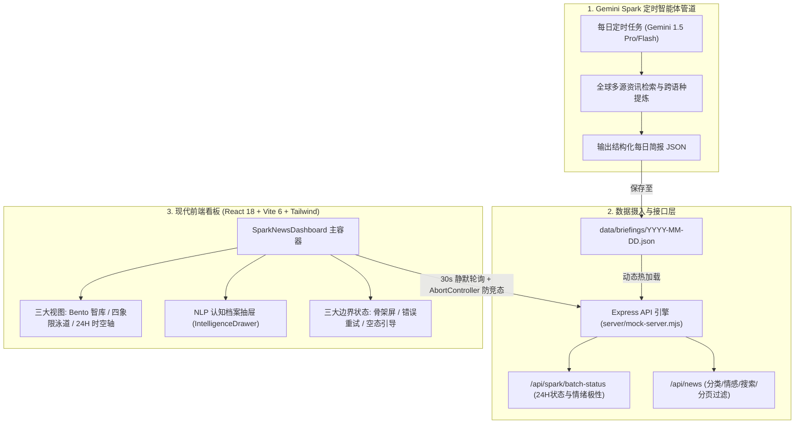

# Gemini Spark 24H 智能体新闻智库看板 (Gemini Spark Intelligence Terminal)

> 基于 **Google Gemini 定时智能体 (Gemini Spark)** 全球前沿资讯日更简报的现代化智库大屏系统。采用暗黑黑曜石玻璃拟态视觉风格，提供 24 小时全球态势感知、情绪极性脉搏与深度认知分析。

---

## 🌟 项目背景与定位 (Spark → Gemini Spark)

- **前身与演进**：本项目最初概念基于大数据批处理管道，现已**全面对齐并重构为 Google Gemini 定时智能体 (Gemini Spark)** 管道。
- **核心数据流**：用户在 Gemini 中配置的每日定时任务（Scheduled Agent Task），全天候自主检索全球权威外媒（Reuters, Bloomberg, FT, Nature, WSJ 等），完成深度长文本提炼、情绪极性量化打分与命名实体（NER）挖掘，输出每日结构化简报（JSON 格式）。
- **前端看板使命**：将复杂的全球化研报转化为具备宏观决策洞察力、兼具前沿科技美学的动态交互终端。

---

## 🏗️ 整体架构设计 (System Architecture)



---

## 📊 核心调整与对照清单 (Audit Matrix)

| 维度 | 原传统 Spark 模式 | 现 Gemini Spark 智能体模式 | 调整状态 |
| :--- | :--- | :--- | :---: |
| **文档定义** | 大数据集群批处理任务说明 | Gemini 1.5 智能体日更简报、Prompt 结构化契约说明 | ✅ 已重构 |
| **环境依赖** | 易产生 JVM / PySpark / 大数据依赖歧义 | 纯轻量 Node.js (>=18) + React 18 + Vite，无冗余庞大依赖 | ✅ 极致精简 |
| **数据接入** | 预想中的集群分区 / 分布式算力节点 | 本地 `data/briefings/YYYY-MM-DD.json` 零配置动态接入 | ✅ 已实现 |
| **系统架构** | 分布式清洗调度管道 | 定时智能体生成 → JSON 热加载 → 30s 前端静默拉取 | ✅ 已闭环 |
| **前端配置** | 传统 Spark Cluster 标题与仪表 | **Gemini Spark Intelligence**、情绪极性心电图与 NER 档案 | ✅ 已升级 |
| **防御机制** | 无防御 | 30 秒静默轮询、AbortController 竞态消除、标题两行防撑破 | ✅ 已验证 |

---

## 🚀 快速启动与开发环境

### 1. 环境要求
- **Node.js**：`>= 18.0.0`
- **npm**：`>= 9.0.0`

### 2. 依赖安装
```bash
npm install
```

### 3. 一键启动前后端联合开发服务
```bash
npm run dev
```
> 执行后将通过 `concurrently` 并行启动两个服务：
> - **后端 API / Mock 引擎**：`http://localhost:3001`
> - **前端 Vite 客户端**：`http://localhost:5173`

### 4. 生产构建验证
```bash
npm run build
```
执行 TypeScript 类型严格检查与 Vite 生产打包。

---

## 📁 目录规范与文件结构

```text
├── data/
│   └── briefings/                       # 存放 Gemini Spark 每天生成的简报 JSON
│       ├── README.md                    # 简报数据格式与字段规范
│       ├── sample-format.json           # 示例 schema
│       └── 2026-09-25.json              # 动态摄入的测试简报
├── server/
│   └── mock-server.mjs                  # Express API 引擎（支持动态读取 briefings/ 与 24h 状态管理）
├── src/
│   ├── components/
│   │   ├── views/
│   │   │   ├── BentoView.tsx            # Bento 智库看板（Hero 大卡与全球热力雷达）
│   │   │   ├── MatrixStreamView.tsx     # 四象限多领域信息流泳道
│   │   │   └── TimelineScrubber.tsx     # 24H 时空轨迹时间轴微刷
│   │   ├── GlobalCategoryBar.tsx        # 4大领域筛选、3种视图切换、历史归档日期选择
│   │   ├── GlobalNewsCard.tsx           # 黑曜石玻璃拟态卡片（两行省略防御）
│   │   ├── IntelligenceDrawer.tsx       # Gemini 认知抽屉（NLP量化与实体档案）
│   │   ├── IntelligenceHeader.tsx       # 顶部全局监控头与全球情绪心电图
│   │   ├── Pagination.tsx               # 暗调分页组件
│   │   ├── RunningStateView.tsx         # 任务生成中雷达动画与前日降级态
│   │   └── SparkNewsDashboard.tsx       # 主容器（30s静默轮询/AbortController/3大边界）
│   ├── services/
│   │   └── api.ts                       # 前端 API 封装层（完整支持 AbortSignal）
│   ├── types/
│   │   └── news.ts                      # 全球化 4 大领域与多维量化 TypeScript 类型定义
│   ├── App.tsx                          # 根组件
│   ├── main.tsx                         # 应用入口
│   └── index.css                        # Tailwind 基础与玻璃拟态微发光样式
├── index.html                           # 页面入口（Gemini Spark 标题与深色底色）
├── package.json                         # 项目脚本与依赖声明
├── tailwind.config.js                   # 暗黑黑曜石与发光阴影调色板
├── tsconfig.json                        # TypeScript 编译配置
├── vite.config.ts                       # Vite 构建与 API 代理配置
└── completed_checklist.md               # 任务完成清单
```

---

## 🔌 如何对接您的真实 Gemini Spark 定时任务

您的 Gemini 定时任务或自动化脚本每天生成简报后，只需将其保存至：
```text
e:\antigravity项目\资讯前端\data\briefings\YYYY-MM-DD.json
```

### JSON 数据格式规范
```json
{
  "batchStatus": {
    "status": "COMPLETED",
    "statusText": "已完成归档",
    "generatedTime": "2026-09-24 02:30:00 UTC",
    "nextScheduleTime": "明日 02:30:00 UTC",
    "currentStage": "Gemini 1.5 智能体多源交叉校验完成"
  },
  "items": [
    {
      "id": "gemini-2026-09-24-001",
      "title": "中文核心标题（必填，UI 自动适配两行省略截断）",
      "englishTitle": "Foreign Media Source Title",
      "source": "Reuters",
      "sourceCountry": "US",
      "category": "ai",
      "region": "North America",
      "impactLevel": "critical",
      "summary": "Gemini 提炼的 150-200 字深度研报摘要...",
      "tags": ["OpenAI", "Anthropic", "自主智能体"],
      "sentiment": "positive",
      "sentimentScore": 0.78,
      "nlpKeyEntities": ["OpenAI", "Anthropic", "Autonomous Agents"],
      "coverUrl": "https://images.unsplash.com/...",
      "publishTime": "2026-09-24T08:30:00Z"
    }
  ]
}
```

**自动生效机制**：
1. 本地后台服务无需重启，即时检测到新增的日期文件；
2. 前端顶部**历史归档下拉菜单**自动新增该日期；
3. 前端内置的 **30 秒静默轮询** 会自动检测到最新批次并平滑上屏！
