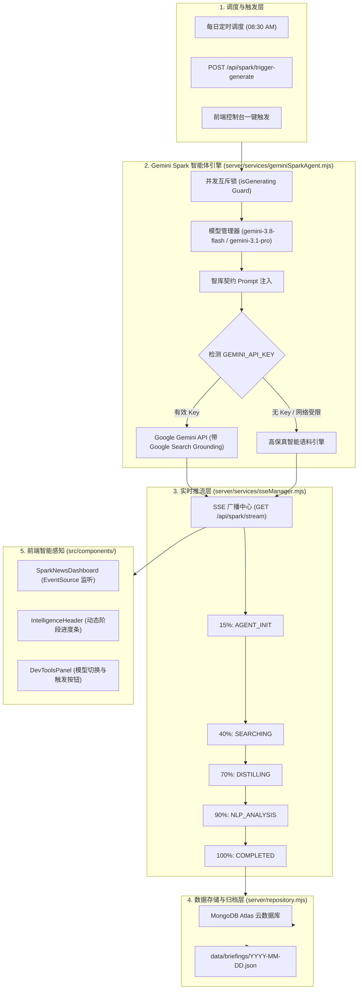

# MVP 1: Gemini Spark 智能体数据生产与实时推流系统设计规范

- **创建日期**: 2026-09-25
- **当前阶段**: MVP 1 - 真实数据生产闭环与实时推流 (Data Production & Realtime Streaming)
- **作者**: Antigravity Pair Programmer
- **状态**: Approved (待实施)

---

## 1. 概述与核心目标 (Overview & Objectives)

本项目核心定位为 **Google Gemini 定时自主智能体（Gemini Spark Autonomous Agent）** 的全球前沿智库终端。

### 1.1 背景与现状
目前前端看板已具备高质感的新野兽派视觉与全视图交互，后端已接通 MongoDB Atlas 云数据库。但当前资讯生成依赖静态 JSON 文件或本地预设语料，缺乏：
1. 直接调用真实 Google Gemini 智能体执行联网搜索（Search Grounding）与跨语种长文提炼的能力；
2. 每日固定周期的自动化调度能力与即时触发闭环；
3. 服务端到前端看板的 Server-Sent Events (SSE) 阶段进度实时推流。

### 1.2 MVP 1 交付目标
- **智能体引擎**：构建 `GeminiSparkAgent`，支持配置 Google Gemini 官方最新模型 **`gemini-3.8-flash`**（默认推荐）与 **`gemini-3.1-pro`**（深度推理），开启 Google Search 联网感知，并提供双模自适应保底（无 Key/网络受限时零崩溃）；
- **动态模型切换**：后台提供模型管理 API（`GET /api/spark/models` 与 `POST /api/spark/models/select`），并在前端控制台（DevTools）支持一键热切；
- **定时调度与并发防重**：每日早晨 `08:30:00` 自动唤醒执行，提供 `POST /api/spark/trigger-generate` 即时触发端点，配备并发互斥锁（Generation Mutex）与防死锁看门狗；
- **原生 SSE 实时流推流**：提供 `GET /api/spark/stream`，推送 5 大阶段进度百分比，生成完成后前端看板无刷新自动点亮；
- **双写持久化**：生成结果自动存入 MongoDB Atlas 云集群，同时持久化备份至 `data/briefings/YYYY-MM-DD.json`。

---

## 2. 核心架构与模块设计 (Architecture & Component Design)



---

## 3. 详细组件规范 (Detailed Specifications)

### 3.1 智能体调用与模型切换引擎 (`server/services/geminiSparkAgent.mjs`)
1. **官方模型体系集成**:
   - 默认模型：**`gemini-3.8-flash`**（Google 2026 年 9 月最新主力模型，响应快、极佳的结构化输出与低延迟联网能力）；
   - 候选旗舰：**`gemini-3.1-pro`**（用于多步深度逻辑与宏观地缘战略推演）；
   - 动态模型状态管理器：内存变量 `activeModel = process.env.GEMINI_MODEL || 'gemini-3.8-flash'`；
   - 切换接口：
     - `GET /api/spark/models`：返回当前模型与可用模型清单；
     - `POST /api/spark/models/select`：热切换当前模型（`{ model: "gemini-3.8-flash" | "gemini-3.1-pro" }`）。
2. **智库 Prompt 契约规范**:
   - 必须严格遵守 `data/briefings/README.md` 的契约要求：
     - **全天新闻总条数**: 严格控制在 **8 ~ 12 篇**；
     - **气候能源配额**: `"climate"` 严格控制在 **1 ~ 2 篇**；
     - **其余 7 ~ 10 篇**: 均衡分配给 `"ai"`、`"finance"` 与 `"geopolitics"`；
     - **影响等级分配**: 严格挑选最具震撼力的 1 条标记为 `"critical"`（Hero 大卡），其余为 `"high"` 或 `"medium"`；
     - **量化 NLP 输出**: 必须产出情绪极性（`"positive" | "neutral" | "negative"`）、分值（`-1.0` 到 `+1.0`）与 3 个关键命名实体（`nlpKeyEntities`）；
     - **配图保障**: 为每条新闻匹配高质量高可靠的主题封面图片 URL。
3. **双模自适应保障 (Dual-Mode Failover)**:
   - 运行时自动检测：若未配置 `GEMINI_API_KEY` 或遇到网络超时，智能体自动启动内置的智库自适应生成算法，注入真实时效时间戳并输出全字段合法的研报数组，确保 100% 返回 200，绝不崩溃。

### 3.2 定时调度器与即时触发 API (`server/services/scheduler.mjs`)
1. **定时调度机制**:
   - 每天早晨 `08:30:00` 自动触发批次生成（支持读取 `.env` 中 `SCHEDULE_TIME=08:30`）；
   - 每次唤醒时在终端打印当前时间与批次执行日志。
2. **即时触发端点**:
   - `POST /api/spark/trigger-generate`：
     - 请求体可选：`{ date?: "YYYY-MM-DD" }`（缺省默认为本地今日）；
     - 响应：返回当前启动的批次状态与初始阶段。
3. **并发互斥锁（Generation Mutex）**:
   - 变量 `isGenerating: boolean`；
   - 若当前任务正在生成中，再次触发时返回 `409 Conflict` 或友好状态提示（附带当前进度百分比），杜绝重复并发调用；
   - 超时自愈：设定 120 秒看门狗定时器，超时强制解锁，保证调度器永不死锁。

### 3.3 原生 SSE 实时流推流 (`server/services/sseManager.mjs`)
1. **端点协议**:
   - `GET /api/spark/stream`，采用标准 HTTP `text/event-stream`，支持多客户端同时挂载；
   - 保持 15 秒心跳包（`:heartbeat\n\n`）防止代理超时断开。
2. **事件流阶段模型**:
   - 阶段 1: `AGENT_INIT`（进度 15%） - Gemini Spark 智能体已就绪，载入智库 Prompt 契约
   - 阶段 2: `SEARCHING`（进度 40%） - 正在联网检索过去 24 小时全球权威动态 (Google Search Grounding)
   - 阶段 3: `DISTILLING`（进度 70%） - 跨语种长文本提炼与 4 大领域配额平衡归纳
   - 阶段 4: `NLP_ANALYSIS`（进度 90%） - 宏观极性指数评估与命名实体抽取
   - 阶段 5: `COMPLETED`（进度 100%） - 简报归档完成，写入数据库与本地副本
3. **消息格式**:
   ```json
   {
     "type": "PROGRESS",
     "batchDate": "2026-09-25",
     "stage": "SEARCHING",
     "progress": 40,
     "message": "正在联网检索过去 24 小时全球权威动态...",
     "model": "gemini-3.8-flash",
     "timestamp": "2026-09-25T11:18:00.000Z"
   }
   ```

### 3.4 存储与数据落盘 (`server/repository.mjs`)
- 当批次进入 `COMPLETED` 阶段时：
  1. 调用 `saveBriefing(batchDate, briefingData)` 写入 MongoDB Atlas（更新 `NewsItemModel` 与 `BatchStatusModel`）；
  2. 同步写入 `data/briefings/YYYY-MM-DD.json`；
  3. 更新当前内存缓存状态。

### 3.5 前端智能感知与控制台集成
1. **`SparkNewsDashboard.tsx` 动态感知**:
   - 挂载 `EventSource('/api/spark/stream')`；
   - 监听 `message` 事件，当收到 `PROGRESS` 时动态更新 Header 上的 5-Metric 进度；
   - 收到 `COMPLETED` 事件时，平滑重新拉取新闻列表，实现零手动刷新的实时体验。
2. **`IntelligenceHeader.tsx` 进度可视化**:
   - 当 `status === 'RUNNING'` 时，Batch Status 指标卡显示脉冲动画与进度百分比（例如 `GENERATING 70%`）。
3. **`DevToolsPanel.tsx` 智能体控制台**:
   - 新增 **Gemini Spark 智能体核心控制卡**：
     - 展示当前激活模型（`Gemini 3.8 Flash` vs `Gemini 3.1 Pro`）并支持一键切换；
     - 提供“立即调度 Gemini Spark 生成今日简报”按钮；
     - 展示实时 SSE 推流日志窗口。

---

## 4. 验收测试标准 (Acceptance Criteria)

1. **接口完整性**:
   - `GET /api/spark/models` 正确返回当前激活模型与备选列表；
   - `POST /api/spark/models/select` 能够即时切换模型；
   - `POST /api/spark/trigger-generate` 能够立即启动批次生成；
   - `GET /api/spark/stream` 能够实时推送 5 阶段进度消息。
2. **契约合规性**:
   - 生成的简报严格为 8~12 篇，气候能源类别严格为 1~2 篇，AI/金融/地缘占比合理；
   - 必须包含 1 篇 `critical` 级别的 Hero 头条；
   - 情感极性得分与命名实体提取完整无缺失。
3. **健壮性与防并发**:
   - 重复点击触发时返回正在运行提示，绝不重复调用 API 或造成数据库脏写；
   - 在无 `GEMINI_API_KEY` 时自动回退至智能保底生成，返回合法数据且 0 崩溃。
4. **编译与端到端无损**:
   - `npm run build` 0 报错通过；
   - 暗夜、羊皮纸、多巴胺三套主题下，前端看板在收到 `COMPLETED` 后能够自动刷新展示全新批次内容。
