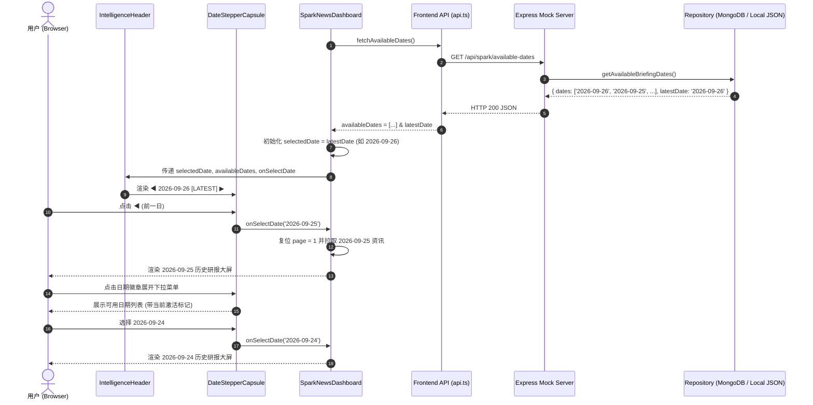

# 历史简报日期步进选择器与多日回溯设计规范 (Design Spec)

- **创建时间**: 2026-09-26
- **设计目标**: 为 Gemini Spark News 智库看板构建生产级历史简报日期步进选择器（`DateStepperCapsule`），实现可用归档日期的动态聚合、前后单日步进翻阅、下拉快速直选与后台新批次无感协同。
- **关联模块**:
  - 服务端仓库层: [`server/repository.mjs`](file:///e:/antigravity项目/资讯前端/server/repository.mjs)
  - 服务端网关层: [`server/mock-server.mjs`](file:///e:/antigravity项目/资讯前端/server/mock-server.mjs)
  - 前端 API 客户端: [`src/services/api.ts`](file:///e:/antigravity项目/资讯前端/src/services/api.ts)
  - 顶部指标栏组件: [`src/components/IntelligenceHeader.tsx`](file:///e:/antigravity项目/资讯前端/src/components/IntelligenceHeader.tsx)
  - 核心步进胶囊组件: [`src/components/DateStepperCapsule.tsx`](file:///e:/antigravity项目/资讯前端/src/components/DateStepperCapsule.tsx)
  - 顶层看板控制舱: [`src/components/SparkNewsDashboard.tsx`](file:///e:/antigravity项目/资讯前端/src/components/SparkNewsDashboard.tsx)
  - 全局样式层: [`src/index.css`](file:///e:/antigravity项目/资讯前端/src/index.css)

---

## 1. 业务背景与问题痛点

### 1.1 现状与痛点
1. **硬编码默认日期**: 当前 [`SparkNewsDashboard.tsx`](file:///e:/antigravity项目/资讯前端/src/components/SparkNewsDashboard.tsx) 状态中默认写死为 `const [selectedDate, setSelectedDate] = useState('2026-09-24')`。尽管后台已成功生成 `2026-09-25` 和 `2026-09-26` 的最新研报，前端受众无法在界面上方便地查看今日与往期的简报；
2. **缺乏日期切换入口**: 看板顶部操作栏仅有“同步批次”和“色彩切换胶囊”，受众无法直观感知系统内沉淀了哪些历史批次，无法前后按日翻阅或快速跳转。

### 1.2 预期收益
- **动态自适应**: 自动定位并呈现最新完成的批次（如今天 `2026-09-26`）；
- **极佳机械交互**: 提供实体触感的前进/后退步进胶囊（`◀` / 日期徽章 / `▶`）与下拉快选浮层，直达任意归档；
- **非侵入式实时协同**: 当受众回溯历史研报时，若后台 SSE 广播今日生成完毕，以轻量呼吸徽标提示切换，避免强行中断阅读。

---

## 2. 系统架构与数据流 (Architecture & Data Flow)



---

## 3. 服务端 API 设计与规范

### 3.1 仓库层方法 `getAvailableBriefingDates()`
- **文件**: [`server/repository.mjs`](file:///e:/antigravity项目/资讯前端/server/repository.mjs)
- **实现逻辑**:
  1. **MongoDB Atlas 模式**:
     - 调用 `NewsItemModel.distinct('batchDate')` 获取所有不同的有效批次日期；
     - 备用：从 `BatchStatusModel.distinct('batchDate')` 合并；
  2. **本地文件 / 降级模式**:
     - 读取 `data/briefings/` 目录下所有以 `.json` 结尾的文件；
     - 使用正则 `^(\d{4}-\d{2}-\d{2})\.json$` 提取文件名中的日期；
     - 与 `memoryNewsStore` 的 `Object.keys()` 合并去重；
  3. **清洗与排序**:
     - 过滤不符合 `YYYY-MM-DD` 格式的无效字符串；
     - 转换为时间戳升序比较，最终输出**严格降序排列**的数组（从近到远）；
     - `latestDate` 取排序后的首个元素 `dates[0]`（若无数据则兜底当前日期字符串）。

### 3.2 接口契约：`GET /api/spark/available-dates`
- **文件**: [`server/mock-server.mjs`](file:///e:/antigravity项目/资讯前端/server/mock-server.mjs)
- **请求方法**: `GET`
- **中间件接入**:
  - `apiRateLimiter` (全局限流 120 次/分保护)
- **响应格式 (HTTP 200)**:
  ```json
  {
    "code": 200,
    "message": "success",
    "data": {
      "dates": [
        "2026-09-26",
        "2026-09-25",
        "2026-09-24",
        "2026-09-23",
        "2026-09-22",
        "2026-09-21"
      ],
      "latestDate": "2026-09-26",
      "totalDates": 6
    }
  }
  ```

---

## 4. 前端组件与交互规范

### 4.1 新增组件：`DateStepperCapsule.tsx`
- **文件路径**: [`src/components/DateStepperCapsule.tsx`](file:///e:/antigravity项目/资讯前端/src/components/DateStepperCapsule.tsx)
- **组件 Props**:
  ```typescript
  export interface DateStepperCapsuleProps {
    currentDate: string;
    availableDates: string[];
    onDateChange: (date: string) => void;
    isLoading?: boolean;
    hasNewerBatchAvailable?: boolean; // 当处于历史日期且收到今日新批次时为 true
    onJumpToLatest?: () => void;
  }
  ```
- **核心交互状态**:
  1. **当前索引计算**:
     - `currentIndex = availableDates.indexOf(currentDate)`；
  2. **步进按钮禁用状态**:
     - **左箭头 `◀` (更早的历史)**: 当 `currentIndex >= availableDates.length - 1` 或 `isLoading` 时禁用（`opacity-40 cursor-not-allowed`）；
     - **右箭头 `▶` (更新的日期)**: 当 `currentIndex <= 0` 或 `isLoading` 时禁用（`opacity-40 cursor-not-allowed`）；
  3. **下拉菜单交互**:
     - 点击主徽章按钮展开/收起下拉浮层；
     - 监听 `mousedown` 事件，点击外部自动收起；
     - 监听键盘 `Escape` 键自动收起；
     - 菜单项高亮：当前选中的日期背景加深，展示 Check 图标与 `[ARCHIVE]` 或 `[LATEST]` 状态徽章。

### 4.2 布局编排：`IntelligenceHeader.tsx`
- 在 [`src/components/IntelligenceHeader.tsx`](file:///e:/antigravity项目/资讯前端/src/components/IntelligenceHeader.tsx) 的右侧操作按钮区：
  - 位于“同步批次”按钮左侧，形成紧凑的“日期步进胶囊 | 同步批次 | DevTools 开关”工具栏；
  - 在移动端/窄屏下自适应换行，确保按键区域足够易于触控点击（最小触控尺寸 36px）。

### 4.3 顶层调度：`SparkNewsDashboard.tsx`
- **初始化挂载**:
  - 组件初次加载时触发 `fetchAvailableDates()`；
  - 获取成功后，若当前 `selectedDate` 不在 `availableDates` 中或首次启动，自动将 `selectedDate` 切换为 `latestDate`；
  - 传递给 `loadDashboardData(false)`，直接拉取该日期的研报。
- **SSE 事件与实时协同**:
  - 当 SSE 接收到 `COMPLETED` 广播（例如生成了新的批次 `newBatchDate`）：
    - 重新拉取 `fetchAvailableDates()` 刷新可用日期池；
    - 如果当前用户正停留在最新日期，自动静默拉取新数据；
    - 如果当前用户正在查看更早的历史日期（如 `selectedDate < newBatchDate`），设置 `hasNewerBatchAvailable = true`，在胶囊旁呈现“⚡ 今日最新简报已出炉 [点击查看]”，点击执行 `onJumpToLatest()` 切回今天。

---

## 5. 视觉与主题契约 (Theming & Contrast 21:1)

遵循项目既定的新野兽派（Neo-Brutalism）与多主题体系：
1. **暗夜黑曜石 (`dark`)**:
   - 胶囊背景: `bg-slate-900/90`，外框 `border-cyan-500/30`，文字纯白，悬停青色微光；
2. **经典档案羊皮纸淡色 (`light`)**:
   - 胶囊按键采用纯黑底色（`bg-black text-white`），零羽化实体投影 `2px 2px 0 #000000`；
   - 强制守护文字与图标为高对比度纯白 `#ffffff`，严格满足 **WCAG AAA 21:1**；
   - 下拉浮层采用暖黄羊皮纸底色（`#f4ebd9`），`2px solid #000` 粗黑边框，实体黑阴影 `4px 4px 0 #000000`；
3. **高能波普多巴胺 (`dopamine`)**:
   - 胶囊按键采用热粉硬阴影 `2px 2px 0 #ff007f`，悬停轻微倾斜 `-0.5deg`。

---

## 6. 异常边界与防御性设计 (Defensive Engineering)

1. **空日期列表兜底**: 若后端由于极端情况返回空数组，步进器安全回退显示当前日期，左右步进按钮安全禁用，不抛出 React 渲染异常；
2. **异步竞态取消**: 快速连续点击 `◀` 或 `▶` 切换不同日期时，`SparkNewsDashboard.tsx` 内置的 `abortControllerRef` 自动取消旧请求，杜绝晚返回的旧日期数据覆盖新选中日期；
3. **分页复位**: 每次切换日期时，强制复位 `page = 1`，避免在上一日期处于第 3 页时切换到只有 1 页的历史日期导致空屏。

---

## 7. 自动化测试与验收标准 (Acceptance Criteria)

1. **单测套件**:
   - 编写 `tests/availableDates.test.mjs`，覆盖：
     - 正确聚合本地 `data/briefings/*.json` 与内存降级日期；
     - 严格降序排列且无重复日期；
     - `GET /api/spark/available-dates` 返回 200 与结构化数据；
2. **构建与类型检查**:
   - `npm run build` 100% 成功，TypeScript 检查 0 errors, 0 warnings；
3. **E2E 验证升级**:
   - 在 `scripts/verify-spark-pipeline.mjs` 中增加可用日期接口调用与断言校验；
4. **人工交互验证**:
   - 页面初始进入时显示最新批次（`2026-09-26`）；
   - 点击 `◀` 切换到 `2026-09-25`，资讯大屏与状态栏即刻平滑更新；
   - 点击下拉菜单直达 `2026-09-24`；
   - 检查淡色主题下文字与图标是否清晰可读（无深黑字与黑底混杂）。
