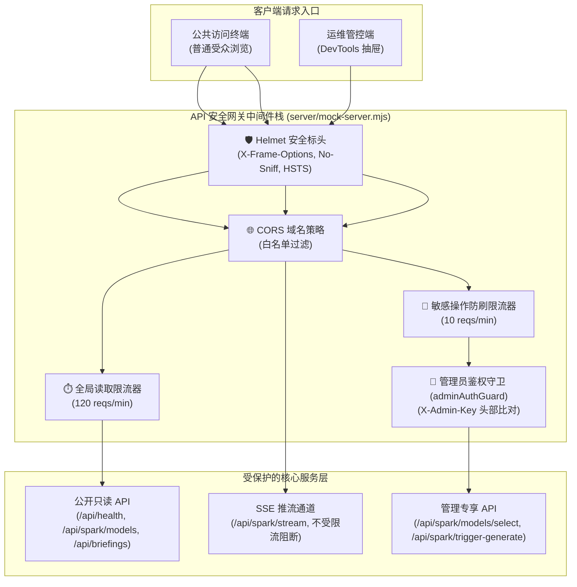

# Gemini Spark 智库系统 · MVP 2 生产级安全防护与稳定性加固设计规范 (Design Spec)

- **作者/制定者**: Antigravity Core Architect
- **创建时间**: 2026-09-26 10:05 (UTC+8)
- **状态**: APPROVED
- **目标分支**: `feature/mvp2-security-and-stability` -> `master`

---

## 1. 业务与安全背景 (Context & Problem Statement)

在 **MVP 1 (Phase 1)** 中，系统已成功实现：
1. `gemini-3.8-flash`（默认工作马）与 `gemini-3.1-pro`（深度推演候选）的白名单管理与动态热切换；
2. 每日 `08:30:00` 定时巡检与自主生产流；
3. 基于原生 HTTP `text/event-stream` 的 5 阶段实时进度 SSE 推流；
4. 并发互斥锁（409 Conflict）与 120 秒防死锁看门狗；
5. 新野兽派、波普多巴胺与黑曜石暗夜三主题极致视觉体系与 21:1 高对比度（Issue #UI-001 已修复）。

然而，当前后端服务入口（`server/mock-server.mjs`）直接暴露在公网环境下时存在如下安全与稳定性隐患：
- **无鉴权风险**：任何外部攻击者均可调用 `POST /api/spark/trigger-generate` 触发高开销的智能体工作流，或调用 `POST /api/spark/models/select` 篡改全局激活模型；
- **高频攻击与探测**：缺乏限流机制，容易遭受 CC 攻击或高频爬虫扫描，耗尽服务器资源与配额；
- **HTTP 响应头防护薄弱**：缺乏安全标头（Clickjacking, MIME Sniffing, XSS 等）；
- **生产托管割裂**：本地开发依赖 Vite 独立端口（5173）与后端（3001），缺乏一体化生产容器与静态资源代理配置。

因此，**MVP 2** 聚焦于系统的**生产级安全防护、管理鉴权与自愈容器化**。

---

## 2. 核心架构设计 (Architecture Blueprint)



---

## 3. 详细设计规范 (Technical Specifications)

### 3.1 安全防护中间件栈 (Helmet & Rate Limiting)
1. **Helmet 响应头防护**:
   - 引入 `helmet` 库；
   - 配置宽松且安全的 Content-Security-Policy (CSP)，允许 SVG 数据 URI、Vite 开发脚本、本地内联样式及同源 WebSocket/SSE 管道；
   - 强制启用 `xContentTypeOptions: true`、`xFrameOptions: { action: 'deny' }`、`hidePoweredBy: true`。
2. **分级限流防刷机制 (express-rate-limit)**:
   - **全局常规限流器 (`apiRateLimiter`)**: 针对所有 `/api/*` 请求，窗口期 1 分钟，限制每个 IP 最多 120 次请求。超限返回 HTTP 429；
   - **敏感操作严格限流器 (`adminRateLimiter`)**: 针对 `/api/spark/trigger-generate` 与 `/api/spark/models/select`，窗口期 1 分钟，限制最多 10 次请求。超限返回 HTTP 429；
   - **推流接口豁免**: 原生 SSE 推流通道 `GET /api/spark/stream` 与健康检查 `GET /api/health` 排除在限流器之外，防止保活心跳与健康探测被阻断。
3. **CORS 跨域域名白名单**:
   - 支持环境变量 `CORS_ORIGIN`（多个以逗号隔开，开发环境默认放行 `http://localhost:5173`, `http://127.0.0.1:5173`）。

### 3.2 核心管理接口鉴权守卫 (X-Admin-Key Auth Guard)
1. **环境变量与秘钥规范**:
   - 服务端 `.env` 中声明 `ADMIN_KEY`；
   - 若未配置 `ADMIN_KEY`，在生产环境 (`NODE_ENV=production`) 启动时抛出警告并强制生成强随机临时秘钥打印至日志，避免未配置时裸奔；在开发/测试环境默认 fallback 为 `gemini-spark-dev-secret`。
2. **中间件逻辑 (`server/middleware/adminAuth.mjs`)**:
   - 提取请求头：`const reqKey = req.headers['x-admin-key'] || (req.headers['authorization']?.startsWith('Bearer ') ? req.headers['authorization'].slice(7) : null);`；
   - 采用常数时间比较算法（防止定时侧信道攻击）：使用 Node 内置 `crypto.timingSafeEqual` 比对 Buffer；
   - 拦截结果：
     - 若秘钥不匹配或缺失，返回 `HTTP 401 Unauthorized`：
       ```json
       {
         "code": 401,
         "message": "未授权操作：该管理接口需要提供有效的 X-Admin-Key 凭证",
         "timestamp": "2026-09-26T10:05:00.000Z"
       }
       ```
     - 若比对成功，调用 `next()`。
3. **受保护的管理端点**:
   - `POST /api/spark/models/select`
   - `POST /api/spark/trigger-generate`
   - `POST /api/briefings/import` (若使用)

### 3.3 前端 API 与 DevTools 控制舱集成
1. **`src/services/api.ts` 升级**:
   - 导出 `getAdminKey()` 与 `setAdminKey(key: string)`；
   - `localStorage` 持久化键名：`gemini_spark_admin_key`；
   - `selectSparkModel()` 与 `triggerSparkGenerate()` 自动注入请求头 `X-Admin-Key: getAdminKey()`。
2. **`src/components/DevToolsPanel.tsx` 交互增强**:
   - 新增 **【🔑 运维管理秘钥配置】** 模块；
   - 提供输入框（带显示/隐藏密码眼图标）以及“保存秘钥”与“清除秘钥”操作；
   - 状态徽章：检测当前是否有存储秘钥，显示 `[已配置秘钥]` 或 `[未配置 (只读模式)]`；
   - 当调用返回 401 时，弹窗/日志高亮提示：“鉴权失败：请检查输入的 X-Admin-Key 是否与服务端一致”。

### 3.4 生产托管与容器自愈 (PM2 & Dockerfile)
1. **一体化生产静态服务支持**:
   - 在 `server/mock-server.mjs` 中，当 `process.env.NODE_ENV === 'production'` 时，自动挂载 `dist/` 静态托管，非 API 路由兜底至 `dist/index.html`；
2. **PM2 守护配置 (`ecosystem.config.cjs`)**:
   - 配置进程名为 `gemini-spark-service`；
   - 支持异常崩溃自动重启，内存超过 500MB 自动轮转，输出日志重定向至 `logs/` 目录；
3. **轻量生产 Dockerfile**:
   - 基于 `node:20-alpine` 多阶段构建：第一阶段编译前端静态资源，第二阶段极简运行 Express 服务。

---

## 4. 验收标准与测试矩阵 (Acceptance Criteria)

1. **安全与鉴权单元/集成测试 (`tests/securityAuth.test.mjs`)**:
   - 验证 Helmet 响应头存在（`x-content-type-options: nosniff` 等）；
   - 验证未携带 `X-Admin-Key` 触发生成时返回 `HTTP 401`；
   - 验证携带错误 Key 时返回 `HTTP 401`；
   - 验证携带有效 Key 时正常触发并返回 `HTTP 200`；
   - 验证限流器在连续突发超额请求时准确触发 `HTTP 429 Too Many Requests`；
   - 验证 SSE 流通道与健康检查不受限流影响。
2. **E2E 自动化测试**:
   - `verify-spark-pipeline.mjs` 携带有效管理秘钥执行，7 阶段测试 100% 绿灯。
3. **全站构建编译**:
   - `npm run build` 0 error 0 warning。
