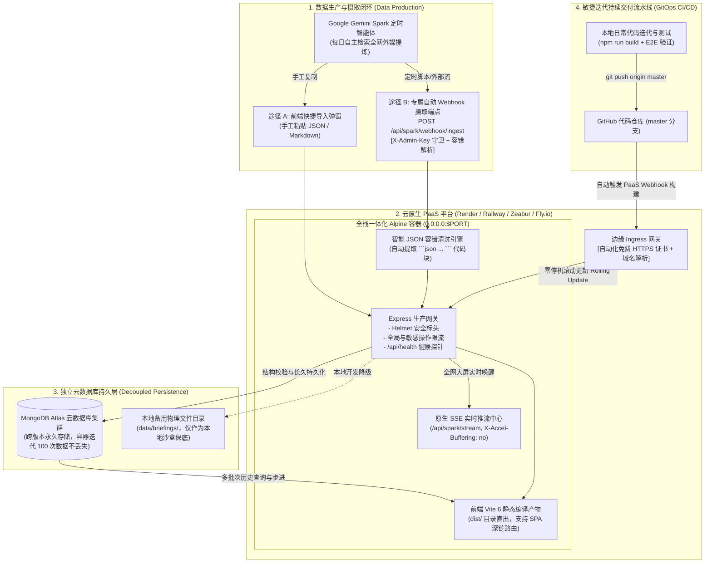

# Gemini Spark News 智库系统 · 云原生 PaaS 部署与 Gemini Spark 智能体 Webhook 自动化设计规范

- **文档版本**: 1.0.0
- **创建日期**: 2026-09-27
- **状态**: 草案已评审通过 (Approved)
- **目标里程碑**: MVP 3 (生产容器化、云原生 PaaS 持续交付与双闭环摄取)

---

## 1. 背景与核心需求 (Context & Requirements)

### 1.1 业务背景
本项目作为全球前沿战略智库大屏系统，其核心数据生产源并非传统的爬虫或大数据中间件，而是用户在 Google Gemini 中配置的 **Gemini Spark 自主智能体（Gemini Spark Autonomous Agent / Scheduled Prompt）**。该智能体每日定时全网检索权威国际外媒（Reuters, Bloomberg, FT, Nature 等），完成跨语种深度提炼与 NLP 极性评分，生成结构化的每日全球简报（JSON 格式）。

### 1.2 核心痛点与优化需求
在面向公网生产发布与长效运营中，面临两大核心场景挑战：
1. **Gemini Spark 定时任务自动化集成**：除了前端手工复制粘贴导入，需要提供原生、安全的自动化数据摄取通道（Webhook API），支持外部定时任务（如 Google Cloud Scheduler, Google Apps Script, Zapier, n8n, GitHub Actions 或自动化脚本）在 Gemini Spark 生成完毕后一键自动直投写入并实时推流。
2. **高频代码迭代与容器无状态化解耦**：用户后续会对前端交互与展示进行频繁的功能迭代与更新（例如增加导出图表、微调视觉）。若采用传统的有状态容器部署，每次 `git push` 重新发布镜像都会销毁容器并导致本地存储的历史简报全部丢失。因此，必须将持久化存储与计算节点彻底解耦（依托 MongoDB Atlas 云数据库），并打造“代码推送到 GitHub 即自动零停机部署”的 GitOps 持续交付体系。

---

## 2. 总体架构拓扑 (Architecture Topology)



---

## 3. 核心设计规范与组件契约 (Detailed Specifications)

### 3.1 智能 Webhook 摄取端点 (`POST /api/spark/webhook/ingest`)

#### 契约设计
- **请求方式**: `POST`
- **请求路径**: `/api/spark/webhook/ingest`
- **安全鉴权**: 
  - 支持 `X-Admin-Key: <ADMIN_KEY>` 请求头
  - 同时支持 URL Query 参数 `?key=<ADMIN_KEY>`（便于无法自定义请求头的第三方 Webhook 工具如某些通知机器人/快捷脚本直接调用）
  - 采用常数时间比较算法 (`crypto.timingSafeEqual`)，彻底杜绝计时攻击
- **限流防护**: 挂载 `adminRateLimiter`（限制 10 次/分钟），防爆破与防滥用

#### 容错解析引擎设计
Gemini Spark 在输出结构化数据时，可能会携带 Markdown 代码块格式（如 ````json ... ````），甚至前后伴随少量模型问候语。后端内置智能容错解析算法：
1. 若输入直接为合法 JSON 对象或合法 JSON 字符串，直接解析；
2. 若输入为字符串且包含 ````json` ... ```` 代码块，正则优先提取代码块内的核心内容；
3. 若包含首尾多余空白或注释字符，自动剥离清洗；
4. 校验简报根结构：
   - 必须包含 `batchStatus` 对象（或自动推断补全）；
   - 必须包含 `items` 数组（新闻条数 `>= 1`）；
   - 自动确定所属归档日期 `date`（优先读取传入参数，未传入时从 `batchStatus.generatedTime` 或当日常规日期提取，格式必须为 `YYYY-MM-DD`）。

#### 持久化与广播链路
1. 校验通过后，调用 `saveBriefing(date, parsedData)`；
2. 若已配置 `MONGO_URI`，数据即时永久写入 MongoDB Atlas 云数据库的 `briefings` 集合，同时双写本地保底文件；
3. 写入成功后，立即调用 `broadcastSSEEvent` 向所有连接客户端广播：
   ```json
   {
     "type": "COMPLETED",
     "stage": "COMPLETED",
     "progress": 100,
     "message": "Gemini Spark 最新批次简报已就绪并同步入库",
     "data": {
       "date": "2026-09-27",
       "total": 12,
       "source": "webhook"
     }
   }
   ```
4. 在线的前端看板接收到该事件后，顶部日期步进胶囊下方即刻弹跳高光提示：“今日最新研报已就绪 · 点击查看”，实现真正全网双向实时协同！

---

### 3.2 容器网络与端口动态绑定规范

在云原生 PaaS 环境下（如 Render, Railway, Zeabur, Fly.io）：
1. 容器宿主网络要求应用必须显式监听 `0.0.0.0`，严禁仅监听 `localhost` 或 `127.0.0.1`；
2. 监听端口必须优先读取环境变量 `process.env.PORT`：
   - Render 默认动态分配 `PORT=10000`；
   - Railway / Zeabur 动态注入随机内部端口；
   - 本地开发未指定时保底 `3001`；
3. 代码调整：
   ```javascript
   const PORT = process.env.PORT || 3001;
   app.listen(PORT, '0.0.0.0', () => {
     console.log(`[Gemini Spark Intelligence API] Running on http://0.0.0.0:${PORT} (env: ${process.env.NODE_ENV || 'development'})`);
   });
   ```

---

### 3.3 活性与就绪健康探针 (`GET /api/health`)

PaaS 平台依赖健康检查端点判定容器是否启动完成并决定是否切换流量。
`GET /api/health` 规范输出结构：
```json
{
  "code": 200,
  "status": "UP",
  "version": "1.0.0",
  "environment": "production",
  "timestamp": "2026-09-27T10:30:00.000Z",
  "uptime": 124.5,
  "database": {
    "type": "mongodb",
    "connected": true
  },
  "scheduler": {
    "status": "idle",
    "nextScheduleTime": "明日 08:30:00"
  },
  "model": {
    "active": "gemini-3.8-flash"
  }
}
```
HTTP 状态码严格返回 `200`，确保 PaaS 边缘路由探针秒级通过。

---

### 3.4 PaaS 平台声明式配置规范 (Infrastructure as Code)

#### 1. Render (`render.yaml`)
```yaml
services:
  - type: web
    name: gemini-spark-intelligence
    runtime: docker
    plan: starter
    region: singapore
    buildCommand: ""
    startCommand: ""
    healthCheckPath: /api/health
    envVars:
      - key: NODE_ENV
        value: production
      - key: PORT
        value: 10000
      - key: ADMIN_KEY
        generateValue: true
      - key: MONGO_URI
        sync: false
      - key: GEMINI_API_KEY
        sync: false
      - key: GEMINI_MODEL
        value: gemini-3.8-flash
      - key: SCHEDULE_TIME
        value: "08:30"
```

#### 2. Railway (`railway.json`)
```json
{
  "$schema": "https://railway.app/railway.schema.json",
  "build": {
    "builder": "DOCKERFILE",
    "dockerfilePath": "Dockerfile"
  },
  "deploy": {
    "restartPolicyType": "ON_FAILURE",
    "restartPolicyMaxRetries": 10,
    "healthcheckPath": "/api/health",
    "healthcheckTimeout": 100
  }
}
```

#### 3. Fly.io (`fly.toml`)
```toml
app = "gemini-spark-intelligence"
primary_region = "sin"

[build]
  dockerfile = "Dockerfile"

[http_service]
  internal_port = 3001
  force_https = true
  auto_stop_machines = "stop"
  auto_start_machines = true
  min_machines_running = 1

[[http_service.checks]]
  grace_period = "15s"
  interval = "30s"
  method = "GET"
  path = "/api/health"
  timeout = "5s"
```

---

### 3.5 部署与运维指南体系 (`docs/deployment/PAAS_DEPLOYMENT_GUIDE.md`)

编写一份完整的、面向开发者的落地操作指南，涵盖：
1. **前置准备**：
   - 创建 GitHub 仓库并推送最新代码；
   - 申请免费 MongoDB Atlas 集群（M0 Sandbox，512MB 永久免费），获取连接串；
   - 获取 Google Gemini API Key。
2. **四大平台一键托管实操**：
   - **Render 部署步骤**：连接 GitHub、导入 `render.yaml`、配置环境变量、分配免费 `.onrender.com` 域名；
   - **Zeabur 部署步骤**：一键导入 GitHub 仓库、自动识别 Dockerfile、配置环境变量与域名；
   - **Railway 部署步骤**：新建项目、从 GitHub 导入、添加环境变量、一键发布；
   - **Fly.io 部署步骤**：`fly launch` 自动基于 `fly.toml` 部署到最近边缘节点。
3. **Gemini Spark 自动直投 Webhook 调用示例**：
   - `curl` 命令行调用模版；
   - Google Apps Script 自动化脚本示例（在 Google 云端每天自动抓取并推送）；
   - Python / Node.js 极简推送脚本模版。
4. **GitOps 日常无感迭代发布工作流**：
   - 本地改动 -> `npm run build` -> `git push` -> 云端 2 分钟自动滚动更新完成。

---

## 4. 自动化验证与质量防线 (Verification Strategy)

1. **Webhook 单元与集成测试套件 (`tests/webhookIngest.test.mjs`)**：
   - 验证正确 `X-Admin-Key` 下投递标准 JSON 能够成功写入并返回 200；
   - 验证通过 URL query `?key=...` 传递密钥的鉴权放行；
   - 验证无密钥或错误密钥时安全拦截并返回 HTTP 401；
   - 验证携带 Markdown ````json ... ```` 标记的文本能够被正确提取清洗；
   - 验证投递成功后 SSE 广播事件正确发出。
2. **E2E 闭环脚本升级 (`scripts/verify-spark-pipeline.mjs`)**：
   - 在流水线中新增对 `POST /api/spark/webhook/ingest` 的真实往返校验。
3. **生产构建检查**：
   - `npm run build` 确保 TypeScript 与 Vite 生产构建 0 错误 0 警告；
   - 运行全量测试套件确保 100% 绿灯。

---

## 5. 结论

本设计方案将应用解耦为“无状态轻量计算容器 + MongoDB Atlas 云端长效持久层”，并通过智能 Webhook 端点直接打通 Gemini Spark 定时生产流。无论未来进行多少次高频迭代更新，系统均可通过 GitHub 自动构建实现零停机发布，且历史简报数据永不丢失。
