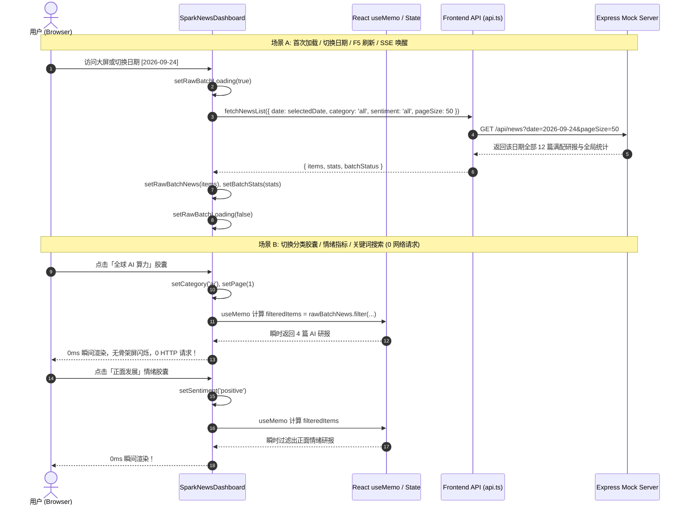

# 客户端批次内存全量缓存与 0ms 响应式过滤引擎设计规范 (Design Spec)

- **创建时间**: 2026-09-30
- **设计目标**: 将 Gemini Spark News 智库看板现有的“每次切换分类/情绪/搜索均调用后端 API 过滤”模式，重构升级为“**单日批次一次拉取、客户端全量内存缓存、0 网络请求、0 毫秒即时切片**”的响应式高性能架构。
- **关联模块**:
  - 顶层看板控制舱: [`src/components/SparkNewsDashboard.tsx`](file:///e:/antigravity项目/资讯前端/src/components/SparkNewsDashboard.tsx)
  - 分类与视图控制栏: [`src/components/GlobalCategoryBar.tsx`](file:///e:/antigravity项目/资讯前端/src/components/GlobalCategoryBar.tsx)
  - 前端 API 客户端: [`src/services/api.ts`](file:///e:/antigravity项目/资讯前端/src/services/api.ts)
  - 各内容视图组件: [`BentoView`](file:///e:/antigravity项目/资讯前端/src/components/views/BentoView.tsx), [`MatrixStreamView`](file:///e:/antigravity项目/资讯前端/src/components/views/MatrixStreamView.tsx), [`TimelineScrubber`](file:///e:/antigravity项目/资讯前端/src/components/views/TimelineScrubber.tsx)

---

## 1. 业务背景与问题痛点

### 1.1 现状与痛点
1. **分类切换存在网络往返延时**: 当前 [`SparkNewsDashboard.tsx`](file:///e:/antigravity项目/资讯前端/src/components/SparkNewsDashboard.tsx) 中 `loadDashboardData` 严格依赖 `[selectedDate, category, sentiment, search, page]`。当用户点击顶栏任一分类胶囊（如「全球 AI 算力」或「宏观金融」）或情绪胶囊时，前端均会向后端发起一次 `GET /api/news?category=...` 请求。
2. **骨架屏闪烁与布局跳动**: 每次触发网络请求都会短暂将 `isInitialLoading` 置为 `true`，导致卡片区域闪烁骨架屏，影响浏览连贯性。
3. **数据规模与架构失配**: Gemini Spark 每日批次规范为精选 **12 篇满配深度研报**（单日全量 JSON 大小仅约 20KB~35KB）。为 12 篇数据进行频繁的服务端查询与网络往返，不仅消耗不必要的网络连接开销，也违背了极速流畅的桌面级交互体验。

### 1.2 预期收益
- **0 网络请求**: 在当前日期内自由切换分类胶囊、情绪指示器、输入搜索词，不再产生任何额外 HTTP fetch；
- **0 毫秒即刻响应**: 借助 React `useMemo` 进行浏览器内存计算，视图瞬时切换，消除骨架屏闪烁；
- **批次全景感知稳定**: 无论当前筛选哪个分类，顶栏情绪指数与各分类胶囊上的统计徽章保持全局稳定准确；
- **优雅平滑降级**: 仅在切换日期、F5 刷新页面、手动重试或后台 SSE 广播推流时拉取后端数据。

---

## 2. 系统架构与数据流 (Architecture & Data Flow)



---

## 3. 详细设计与实现细节

### 3.1 状态设计与依赖解耦

在 [`SparkNewsDashboard.tsx`](file:///e:/antigravity项目/资讯前端/src/components/SparkNewsDashboard.tsx) 中新增全量原始批次状态，并解耦请求调度：

```typescript
// 1. 原始批次全量缓存状态
const [rawBatchNews, setRawBatchNews] = useState<GlobalNewsItem[]>([]);
const [rawBatchStats, setRawBatchStats] = useState<NewsStats | null>(null);

// 2. 将 loadDashboardData 依赖收窄至 [selectedDate]
const loadDashboardData = useCallback(async (isSilent = false) => {
  if (abortControllerRef.current) {
    abortControllerRef.current.abort();
  }
  const controller = new AbortController();
  abortControllerRef.current = controller;

  if (!isSilent) {
    setIsInitialLoading(true);
    setErrorMessage(null);
  } else {
    setIsSilentRefreshing(true);
  }

  try {
    // 一次性拉取当前日期的全部 12 篇研报与批次监控状态
    const [batchStatusRes, newsRes] = await Promise.all([
      fetchSparkBatchStatus(selectedDate, controller.signal),
      fetchNewsList({
        date: selectedDate,
        category: 'all',
        sentiment: 'all',
        pageSize: 50 // 保证容纳当前日期的全部研报
      }, controller.signal)
    ]);

    setStatusInfo(batchStatusRes);
    setRawBatchNews(newsRes.items);
    setRawBatchStats(newsRes.stats);
    setErrorMessage(null);

    if (isSilent) {
      showToast('批次数据同步完成：已载入最新 Gemini Spark 情报');
    }
  } catch (err: any) {
    if (err.name === 'AbortError') return;
    console.error('[SparkNewsDashboard] 数据拉取异常:', err);
    if (!isSilent || rawBatchNews.length === 0) {
      setErrorMessage(err.message || '网络连接中断或 Gemini Spark 接口异常');
    }
  } finally {
    if (!isSilent) {
      setIsInitialLoading(false);
    }
    setIsSilentRefreshing(false);
  }
}, [selectedDate, showToast]);
```

### 3.2 纯前端响应式内存过滤引擎 (`useMemo`)

基于 `rawBatchNews`、`category`、`sentiment`、`search` 进行纯前端高效切片：

```typescript
// 1. 多维过滤后的研报列表
const filteredNewsItems = useMemo(() => {
  // 收藏夹模式：直接读取本地 localStorage 收藏列表
  if (category === 'bookmarks') {
    let list = [...bookmarks];
    if (sentiment !== 'all') {
      list = list.filter(i => i.sentiment === sentiment);
    }
    if (search.trim()) {
      const q = search.trim().toLowerCase();
      list = list.filter(i =>
        i.title.toLowerCase().includes(q) ||
        (i.englishTitle && i.englishTitle.toLowerCase().includes(q)) ||
        i.summary.toLowerCase().includes(q) ||
        i.source.toLowerCase().includes(q) ||
        i.tags.some(t => t.toLowerCase().includes(q)) ||
        (i.nlpKeyEntities && i.nlpKeyEntities.some(e => e.toLowerCase().includes(q)))
      );
    }
    return list;
  }

  // 正常研报流：从 rawBatchNews 纯内存过滤
  let list = rawBatchNews;
  if (category !== 'all') {
    list = list.filter(i => i.category === category);
  }
  if (sentiment !== 'all') {
    list = list.filter(i => i.sentiment === sentiment);
  }
  if (search.trim()) {
    const q = search.trim().toLowerCase();
    list = list.filter(i =>
      i.title.toLowerCase().includes(q) ||
      (i.englishTitle && i.englishTitle.toLowerCase().includes(q)) ||
      i.summary.toLowerCase().includes(q) ||
      i.source.toLowerCase().includes(q) ||
      i.tags.some(t => t.toLowerCase().includes(q)) ||
      (i.nlpKeyEntities && i.nlpKeyEntities.some(e => e.toLowerCase().includes(q)))
    );
  }
  return list;
}, [category, sentiment, search, rawBatchNews, bookmarks]);

// 2. Bento 视图分页切片
const pagedBentoItems = useMemo(() => {
  const start = (page - 1) * pageSize;
  return filteredNewsItems.slice(start, start + pageSize);
}, [filteredNewsItems, page, pageSize]);

// 3. 分页元数据计算
const currentTotal = filteredNewsItems.length;
const currentTotalPages = Math.ceil(currentTotal / pageSize) || 1;

// 4. 当前各视图呈现列表
const currentDisplayItems = viewMode === 'bento' ? pagedBentoItems : filteredNewsItems;
```

### 3.3 全局统计指标与分类胶囊数量同步

确保顶栏与分类过滤区徽章数字始终准确稳定：

```typescript
const currentStats = useMemo<NewsStats>(() => {
  if (category === 'bookmarks') {
    return {
      total: bookmarks.length,
      positive: bookmarks.filter(i => i.sentiment === 'positive').length,
      neutral: bookmarks.filter(i => i.sentiment === 'neutral').length,
      negative: bookmarks.filter(i => i.sentiment === 'negative').length,
      avgSentimentScore: bookmarks.length > 0
        ? Number((bookmarks.reduce((acc, c) => acc + c.sentimentScore, 0) / bookmarks.length).toFixed(2))
        : 0,
      categoryCounts: {
        ai: bookmarks.filter(i => i.category === 'ai').length,
        finance: bookmarks.filter(i => i.category === 'finance').length,
        geopolitics: bookmarks.filter(i => i.category === 'geopolitics').length,
        climate: bookmarks.filter(i => i.category === 'climate').length,
      },
      batchDate: selectedDate
    };
  }

  // 优先采用后端返回的权威统计，或从 rawBatchNews 实时计算兜底
  if (rawBatchStats) {
    return rawBatchStats;
  }

  return {
    total: rawBatchNews.length,
    positive: rawBatchNews.filter(i => i.sentiment === 'positive').length,
    neutral: rawBatchNews.filter(i => i.sentiment === 'neutral').length,
    negative: rawBatchNews.filter(i => i.sentiment === 'negative').length,
    avgSentimentScore: rawBatchNews.length > 0
      ? Number((rawBatchNews.reduce((acc, cur) => acc + cur.sentimentScore, 0) / rawBatchNews.length).toFixed(2))
      : 0,
    categoryCounts: {
      ai: rawBatchNews.filter(i => i.category === 'ai').length,
      finance: rawBatchNews.filter(i => i.category === 'finance').length,
      geopolitics: rawBatchNews.filter(i => i.category === 'geopolitics').length,
      climate: rawBatchNews.filter(i => i.category === 'climate').length,
    },
    batchDate: selectedDate
  };
}, [category, bookmarks, rawBatchStats, rawBatchNews, selectedDate]);
```

---

## 4. 边界兼容性保障

1. **深度链接 (Deep-Linking)**: 用户访问 `?newsId=item-2026-09-24-03` 时，若该研报已在 `rawBatchNews` 中直接秒级选中抽屉打开；若不在（跨日期链接），继续通过 `fetchNewsById` 请求网络打开抽屉，无缝兼容。
2. **后台 SSE 实时推流 (Real-time Broadcast)**: 当后台完成今日简报生成并广播 `COMPLETED` 事件时，触发 `loadDashboardData(true)` 静默拉取最新全量批次并更新 `rawBatchNews`，受众无感获得最新数据。
3. **收藏夹实时同步**: 用户在任意卡片上加星 ⭐ 收藏，`bookmarks` 状态更新直接驱动 `useMemo` 重新渲染，0 延迟无需额外网络请求。
4. **异常重试 (Retry)**: 网络错误时点击重试按钮触发 `loadDashboardData(false)`，重新发起全量批次同步。

---

## 5. 验证与回归测试策略

1. **功能与网络行为验证**:
   - 验证首次加载触发 1 次 `GET /api/news`；
   - 验证连续点击「全球 AI 算力」、「宏观金融」、「地缘经贸」、「气候能源」以及各情绪指标时，**0 次网络请求**，卡片内容瞬间无缝切换；
   - 验证搜索框输入过滤时 **0 次网络请求**；
   - 验证切换归档日期（如切至昨天）时，触发 1 次新日期的全量拉取。
2. **生产构建与测试**:
   - 运行 `npm run build`，确保 TypeScript 0 错误、0 警告；
   - 运行后端全量回归测试集，确保契约保持 100% 绿灯。
